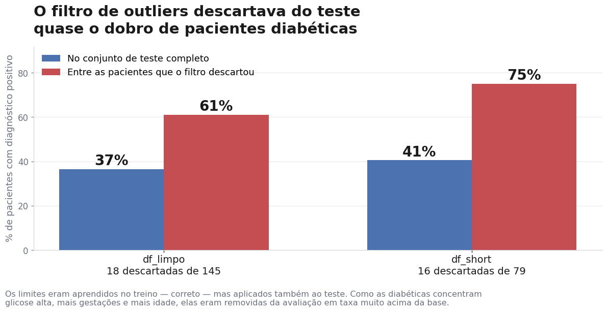

# Machine Learning aplicado à Saúde — dois estudos de caso

Dois projetos completos de classificação clínica, desenvolvidos na disciplina **IA aplicada à Saúde**, do curso de **Inteligência Artificial Aplicada** da **PUC-PR**.

Ambos foram entregues e aprovados na época. Quase um ano depois, os notebooks foram reabertos e submetidos a uma **auditoria metodológica** que reescreveu boa parte das conclusões originais — é esse segundo passe que este repositório documenta.

O interesse aqui não está nos datasets — Cleveland e Pima são material de sala de aula, usados à exaustão. Está no que a revisão encontrou: erros que inflavam os resultados sem que nenhuma métrica acusasse, e uma diferença de desempenho entre grupos de pacientes que a acurácia escondia.

| Projeto | Dataset | Tarefa | Notebook |
| :--- | :--- | :--- | :--- |
| **Diagnóstico de doenças cardiovasculares** | Cleveland Clinic / UCI — 303 pacientes, 13 variáveis | Classificação binária | [Abrir](atividade%20somativa%201/Diagnóstico_de_Doenças_Cardiovasculares_usando_Machine_Learning.ipynb) |
| **Risco de diabetes na população Pima** | Pima Indians Diabetes / NIDDK — 768 pacientes, 8 variáveis | Classificação binária | [Abrir](atividade%20somativa%202/somativa_2.ipynb) |

Os notebooks estão com todas as saídas salvas — gráficos, tabelas de métricas e curvas ROC são visíveis direto no GitHub, sem precisar executar nada.

---

## O que a auditoria encontrou

### 1. Outliers estavam sendo removidos do conjunto de teste

O critério do IQR era aprendido no treino — correto — mas aplicado também ao teste. O efeito, medido:

| | Pacientes descartadas do teste | Quantas eram diabéticas |
| :--- | ---: | ---: |
| `df_limpo` | 18 de 145 | **11 (61%)** |
| `df_short` | 16 de 79 | **12 (75%)** |



O filtro removia preferencialmente as pacientes doentes, porque são elas que têm glicose alta, mais gestações e mais idade. No `df_short`, o limite superior de `Age` caía em 55,5 anos: toda paciente acima disso saía da avaliação.

Em produção, uma clínica não pode se recusar a avaliar uma paciente de 60 anos por ela ser "outlier". O teste existe para simular a realidade — filtrá-lo infla as métricas e esconde exatamente os erros que importam.

**Correção:** limpeza restrita ao treino, teste intacto.

### 2. Correlações lidas a olho em um mapa de calor

Vários coeficientes citados no texto não correspondiam a nenhum método de correlação. Um deles, `trestbps` = 0,000, servia de base para a hipótese de "artefato nos dados". O valor real é 0,151 — não havia artefato, havia erro de leitura.

**Correção:** todas as correlações passaram a ser calculadas no próprio notebook, com a saída visível.

---

## Decisões metodológicas

**Divisão estratificada.** Sem `stratify`, o teste do `df_short` ficava com 40,5% de positivos contra 31,3% no treino. A avaliação media o sorteio, não o modelo.

**Validação cruzada antes de declarar vencedor.** Os conjuntos de teste têm 61 a 145 pacientes — um paciente vale de 2 a 4 pontos de recall. Em 5 *folds* estratificados, a diferença entre o melhor e o pior modelo ficou **menor que os desvios-padrão**:

```
XGBoost              0,638 ± 0,083
Random Forest        0,608 ± 0,078
SVM                  0,569 ± 0,066
Regressão Logística  0,562 ± 0,058
KNN                  0,531 ± 0,099
```

Empate técnico. Nenhum modelo é distinguível dos outros com esse volume de dados, e o projeto diz isso em vez de coroar o primeiro da lista.

**Recall acima de acurácia.** Falso positivo custa uma consulta desnecessária; falso negativo manda para casa uma paciente doente. Os dois erros não são equivalentes, e a acurácia trata como se fossem.

**Pipeline contra vazamento.** Padronização encapsulada em `Pipeline`, reajustada a cada divisão — inclusive dentro de cada *fold* da validação cruzada.

**Interpretabilidade como requisito, não enfeite.** Coeficientes com *odds ratio*, *permutation importance* e a decomposição da contribuição de cada variável para uma paciente individual. Um modelo de apoio clínico que não explica a própria decisão não é utilizável.

**Variáveis nominais tratadas como nominais.** `thal` assume os códigos 3, 6 e 7; correlação de Pearson sobre isso não significa nada. Com one-hot encoding, o quadro mudou: `thal_7` (defeito reversível) tem +0,481 de correlação com o diagnóstico, enquanto `thal_6` (defeito fixo) tem +0,105 — praticamente irrelevante. A leitura anterior, sobre o código bruto, escondia essa diferença.

---

## O modelo é justo? Desempenho por subgrupo

Uma métrica global esconde diferenças entre grupos. Em saúde isso não é detalhe estatístico: se o modelo erra mais em um grupo, ele transfere risco para quem costuma ser sub-atendido.

O dataset Cleveland é desbalanceado por sexo — **68% dos pacientes são homens**. Medindo o desempenho separadamente, com `cross_val_predict` para que todos os 303 pacientes recebessem previsão de um modelo que não os viu no treino:

| Grupo | n | Com doença | Recall | Precisão | Acurácia | AUC |
| :--- | ---: | ---: | ---: | ---: | ---: | ---: |
| Homens | 206 | 114 (55,3%) | **0,798** | 0,820 | 0,791 | 0,872 |
| Mulheres | 97 | 25 (25,8%) | **0,720** | 0,900 | 0,907 | 0,897 |

Duas métricas discordam sobre qual grupo é melhor atendido:

- A **acurácia** diz que o modelo vai melhor com as mulheres — 0,907 contra 0,791.
- O **recall** diz o contrário — 0,720 contra 0,798.

Quem está certo é o recall. A acurácia das mulheres é maior apenas porque a doença é muito menos prevalente nelas nesta amostra (25,8% contra 55,3%): quando três em cada quatro pacientes são saudáveis, acertar "saudável" fica fácil e a acurácia sobe sozinha.

Na prática, o modelo **encontra 80% dos homens doentes e 72% das mulheres doentes**. A diferença recai sobre o grupo que já é minoria na amostra — e a métrica mais reportada em portfólios é justamente a que esconde isso.

O diagnóstico da causa importa: o **AUC das mulheres é até um pouco melhor** (0,897 contra 0,872). O modelo *ordena* o risco tão bem para elas quanto para eles. O problema não está no aprendizado, e sim no **limiar de decisão** — o corte fixo de 0,5 é inadequado para um subgrupo de baixa prevalência. Calibrar o limiar por subgrupo recuperaria boa parte da diferença.

**Ressalva:** há apenas 25 mulheres com diagnóstico positivo na amostra. Uma diferença de 8 pontos no recall equivale a cerca de 2 pacientes. O achado é consistente com a composição do dataset e com a teoria, mas não é conclusivo — serve como alerta e próximo passo, não como veredito.

---

## Limitação registrada, não escondida

O melhor modelo deixa passar entre **22% e 46% das pacientes doentes** no limiar padrão de 0,5. Para uma ferramenta de triagem isso é insuficiente.

A AUC de 0,86 mostra que o modelo *ordena* bem o risco — o problema é onde se corta. Baixar o limiar aumenta o recall ao custo de mais falsos positivos, e num fluxo cujo desfecho é "chamar a paciente para uma consulta", esse custo é aceitável. A curva ROC está nos notebooks justamente para escolher esse ponto com o corpo clínico.

Há ainda um limite de generalização: o dataset Pima contém exclusivamente mulheres com 21 anos ou mais de uma população específica. O modelo não deve ser aplicado a outros perfis sem revalidação — o que é, antes de uma questão técnica, uma questão ética.

---

## O que eu levo desta auditoria

**Uma limpeza que melhora as métricas merece desconfiança, não comemoração.** Remover outliers do teste fez todos os números subirem. Foi exatamente por isso que o erro sobreviveu à primeira entrega: nada no output indicava problema. Hoje, quando uma decisão de pré-processamento melhora o resultado, minha primeira pergunta é o que ela removeu.

**Número que está no texto mas não está em nenhuma saída é opinião, não resultado.** Várias correlações do trabalho original vinham de leitura visual de um mapa de calor, e algumas estavam simplesmente erradas — uma delas fundamentou uma hipótese inteira sobre "artefato nos dados". Os notebooks hoje imprimem todos os valores que o texto cita.

**Validação cruzada não serve para melhorar o resultado, serve para saber se ele existe.** No split único havia um vencedor claro. Em 5 *folds*, a diferença entre o melhor e o pior modelo ficou menor que o desvio-padrão. A conclusão honesta passou a ser "empate técnico" — menos vistosa, e correta.

**Acurácia e recall podem discordar sobre qual grupo é melhor atendido.** A análise por sexo mostrou os dois apontando para lados opostos. Escolher a métrica é escolher qual erro você aceita pagar, e em saúde essa escolha tem nome: falso negativo é paciente doente mandado para casa.

**Interpretabilidade não é enfeite de final de notebook.** Foi ela que revelou que as duas variáveis pelas quais o experimento sacrificou metade do dataset tinham efeito quase nulo. Sem essa etapa, a conclusão errada teria permanecido de pé.

---

## Stack

`pandas` · `numpy` · `scikit-learn` · `xgboost` · `matplotlib` · `seaborn`

Cinco algoritmos comparados sob as mesmas condições: Regressão Logística, KNN, Random Forest, XGBoost e SVM.

## Como executar

```bash
pip install pandas numpy scikit-learn xgboost matplotlib seaborn
jupyter lab
```

Os notebooks rodam do início ao fim sem dependências externas. Sementes fixas (`random_state=35`) — os resultados reproduzem exatamente os que estão salvos.

---

## Material da disciplina

A pasta contém também os slides das oito unidades e dois notebooks-tutorial do professor, sobre XAI e sobre PLN aplicado a textos clínicos em português. O contexto técnico detalhado está em [DOCS/](DOCS/).
