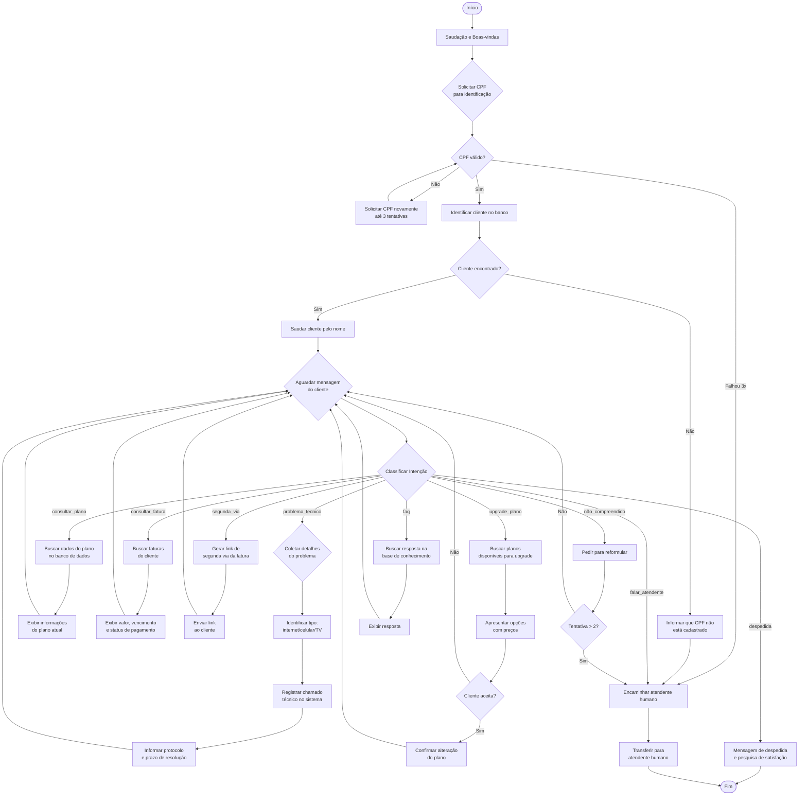

# 2. Definição do Fluxo Conversacional

## Fluxograma Principal

O fluxo conversacional do AtendeBot segue a estrutura abaixo. O diagrama pode ser
visualizado em ferramentas compatíveis com Mermaid (GitHub, VS Code com extensão, etc.).

## Descrição das Intenções (Intents)

| Intent | Descrição | Exemplos de Frases |
|--------|-----------|-------------------|
| `saudacao` | Cliente cumprimenta o agente | "Olá", "Bom dia", "Oi, tudo bem?" |
| `consultar_plano` | Consulta sobre plano contratado | "Qual meu plano?", "Quero ver meu plano atual" |
| `consultar_fatura` | Consulta sobre faturas/contas | "Quanto é minha fatura?", "Qual o valor da conta?" |
| `segunda_via` | Solicita segunda via de boleto | "Preciso da segunda via", "Quero reimprimir o boleto" |
| `problema_tecnico` | Relata problema técnico | "Minha internet caiu", "Sem sinal no celular" |
| `upgrade_plano` | Interesse em mudar de plano | "Quero um plano melhor", "Como faço upgrade?" |
| `falar_atendente` | Solicita atendente humano | "Quero falar com atendente", "Me transfere para alguém" |
| `faq` | Perguntas gerais | "Qual a área de cobertura?", "Como cancelar?" |
| `despedida` | Cliente se despede | "Tchau", "Obrigado, é só isso", "Até mais" |
| `agradecimento` | Cliente agradece | "Obrigado", "Valeu", "Agradeço" |

## Descrição das Entidades

| Entidade | Descrição | Exemplos |
|----------|-----------|----------|
| `cpf` | CPF do cliente | "123.456.789-00", "12345678900" |
| `tipo_servico` | Tipo de serviço referido | "internet", "celular", "TV", "telefone" |
| `tipo_problema` | Natureza do problema técnico | "sem sinal", "lento", "caindo", "não funciona" |
| `mes_referencia` | Mês de referência da fatura | "janeiro", "março", "mês passado" |
| `nome_plano` | Nome de um plano específico | "Plano Turbo 200", "Básico Fibra" |

## Regras de Fallback

1. Se a intenção não for identificada com confiança (score < 0.4), o agente pede para o usuário reformular.
2. Após 2 tentativas sem compreensão, o agente transfere para atendente humano.
3. Se o cliente ficar inativo por mais de 5 minutos, o agente pergunta se ainda precisa de ajuda.
4. Palavras ofensivas são detectadas e geram uma resposta educada solicitando respeito.
