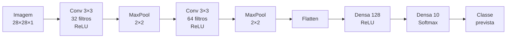

# Redes Neurais — Resumo de Estudo (PUCPR)

> Consolidação das 8 unidades da disciplina. Organizado para **aprendizado**: cada unidade
> traz conceito → arquitetura → parâmetros → armadilhas, e no final há tabelas comparativas,
> glossário e perguntas de autoavaliação.

---

## Mapa da disciplina

| Unidade | Tema | O que você deve saber fazer ao final |
|---|---|---|
| 01 | Introdução às redes neurais | Identificar o tipo de problema e escolher a rede adequada |
| 02 | MLP (Multi-Layer Perceptron) | Montar e parametrizar uma MLP; instalar o ambiente |
| 03 | CNN (Convolutional Neural Network) | Entender convolução, pooling, flatten e camadas densas |
| 04 | Comparativo MLP × CNN | Treinar ambas no MNIST e comparar desempenho |
| 05 | RNC (Rede Neural Competitiva / SOM) | Agrupar dados sem rótulo com o algoritmo de Kohonen |
| 06 | RNT (Rede Neural Temporal / RNN-LSTM) | Prever séries temporais com memória de longo prazo |
| 07 | RNC + RNT — duplo treinamento | Treinar 2 modelos no mesmo código; trocar a base da RNT |
| 08 | RNC + RNT — continuação | Treinamento triplo; salvar e reutilizar o modelo treinado |

**A ideia central da disciplina, repetida em todas as unidades:**
> "Particularidade específica requer ferramenta específica." Não existe rede boa para tudo — existe
> a rede certa para o problema. E o maior desafio **não é escolher a rede, é configurar seus parâmetros.**

---

# UNIDADE 01 — Introdução às Redes Neurais

## 1.1 O que é uma rede neural artificial (RNA)

Estruturas que **imitam o funcionamento do cérebro humano**. Nasceram da necessidade de resolver
problemas complexos demais para tratamento manual.

Componentes:

| Elemento | Papel |
|---|---|
| **Camada de entrada** | Recebe os dados brutos do elemento |
| **Camadas ocultas** | Processam e transformam a informação |
| **Camada de saída** | Produz o resultado (classe, valor previsto...) |
| **Pesos (sinapses)** | Conexões entre neurônios; é o que a rede realmente "aprende" |

## 1.2 Como acontece o treinamento

1. Os dados entram pela camada de entrada.
2. Os cálculos "disparam" valores de camada em camada usando os pesos.
3. A camada de saída produz uma previsão.
4. A **função de perda** mede o erro entre previsão e valor real.
5. Os **pesos são ajustados** para reduzir esse erro.
6. Repete-se até o erro ser minimizado.

> ⚠️ Nem sempre é possível atingir o mínimo do erro. O treino segue até obter um modelo
> **satisfatório** para o problema — não necessariamente perfeito.

## 1.3 Os quatro tipos de problema

| Problema | Definição | Exemplo do material |
|---|---|---|
| **Classificação** | Separar elementos em subconjuntos por características previamente definidas | Separar bolas vermelhas e azuis; reconhecer dígitos 0–9 |
| **Regressão** | Prever um valor numérico a partir de **outros atributos** do mesmo elemento | Prever autonomia (km) a partir da potência do motor (cv) |
| **Previsão de série temporal** | Prever um valor usando **o histórico do próprio atributo** | Projetar o próximo ponto de uma série |
| **Criação e desenvolvimento** | Tarefa criativa baseada em experiência acumulada | Projetar uma casa com base em conhecimento de engenharia |

### 🔑 Regressão × Série temporal — a distinção que mais cai

- **Regressão**: relaciona **dois ou mais atributos diferentes**.
- **Série temporal**: o valor previsto depende **exclusivamente dos valores passados do mesmo atributo**.

## 1.4 Por que usar RNAs em vez de fazer manualmente

1. **Complexidade**: os cálculos e processos iterativos são inviáveis manualmente.
2. **Interpretação de dados**: humanos frequentemente não interpretam os resultados corretamente.
3. **Volume**: reconhecer um dígito é trivial para um humano; reconhecer **milhões** deles não é.
   O problema não é a complexidade, é a **quantidade**.

## 1.5 As quatro redes da disciplina

| Rede | Sigla | Aprendizado | Considera estrutura espacial? | Uso típico |
|---|---|---|---|---|
| Rede multicamadas | **MLP** | Supervisionado | ❌ Não | Classificação, regressão, caracteres manuscritos |
| Rede convolucional | **CNN** | Supervisionado | ✅ Sim (convolução + pooling) | Imagens, detecção de objetos |
| Rede competitiva | **RNC / SNN / SOM** | **Não supervisionado** | — (topologia própria) | Agrupamento/clusterização |
| Rede temporal | **RNT / RNN** | Supervisionado ou não | — (dependência temporal) | Séries temporais, texto, sinais |

**LSTM** (*Long Short-Term Memory*) é a variante da RNT que mantém **memória interna** para aprender
dependências de longo prazo — é a que se usa nos exercícios da disciplina.

---

# UNIDADE 02 — Rede Neural MLP (Multi-Layer Perceptron)

## 2.1 Ambiente de desenvolvimento

Ferramentas oficiais da disciplina: **Anaconda + Spyder 5 + Python 3.1x**.

Passo a passo:
1. Baixar o Anaconda em `www.anaconda.com/products/individual`.
2. Instalar com a opção **"Instalar apenas para mim"**.
3. Abrir o **Anaconda Navigator** → aba **Environments** → **Create** (novo ambiente com Python atual).
4. Ainda em *Environments*, buscar por `tensorflow` e instalar os pacotes:
   - `keras`
   - `tensorboard`
   - `tensorflow`
   - `tensorflow-estimator`
   - `tensorflow-intel`
   - `tensorflow-io-gcs-filesystem`
   - `transformers`
5. Voltar à aba **Home** → instalar o **Spyder** → **Launch**.
6. No Spyder: **View → Window layouts → Horizontal split**.

> Para reabrir depois: Anaconda Navigator → Home → Launch no Spyder.

## 2.2 Conceito

- Cada neurônio da camada de entrada é chamado **perceptron**.
- Os neurônios recebem os dados, aplicam uma **função de ativação** e geram uma saída.
- A camada de saída realiza a **retropropagação do erro** (*backpropagation*), ajustando os pesos
  para reduzir o erro e melhorar a previsão.

## 2.3 Arquitetura: *fully connected*

Cada neurônio de uma camada está conectado a **todos** os neurônios das camadas adjacentes
(anterior e posterior). Os cálculos são "disparados" de camada em camada, sobrepondo valores
existentes, até ativar a camada de saída.

## 2.4 Como dimensionar as camadas ⭐

Este é o ponto mais prático da unidade. Exemplo: classificar dígitos 0–9 em imagens **28×28**.

| Camada | Regra | Cálculo do exemplo |
|---|---|---|
| **Entrada** | = quantidade de dados de **um único elemento** | 28 × 28 = **784 neurônios** |
| **Saída** | = quantidade de **classes** do problema | dígitos 0–9 = **10 neurônios** |
| **Oculta** | ponto de partida: **(entrada + saída) ÷ 2** | (784 + 10) ÷ 2 = **397 neurônios** |

> ⚠️ A regra da camada oculta **não é uma lei** — é apenas um ponto de partida. Determinar o número
> de neurônios e de camadas ocultas é um dos maiores desafios no desenvolvimento de qualquer rede
> neural. É preciso **treinar várias vezes** e comparar o desempenho.

**Ativação da saída (classificação):** apenas **1 neurônio é ativado**. Se a entrada for a imagem
do dígito 4 e o modelo estiver bem treinado, o **quarto neurônio** da saída dispara — os demais ficam em 0.

## 2.5 Funções de ativação

Algoritmos que fazem os cálculos internos para disparar sinais entre neurônios de duas camadas.

| Função | Comportamento | Onde usar |
|---|---|---|
| **ReLU** (*Rectified Linear Unit*) | Retorna 0 se a entrada for negativa; senão retorna a própria entrada | Camadas ocultas (padrão) |
| **Sigmoid** (logística) | `1 / (1 + e^(-x))` → mapeia probabilidades | Saída binária |
| **Tangente hiperbólica** | `(e^x - e^(-x)) / (e^x + e^(-x))` → mapeia entre **-1 e 1** | Entradas simétricas sobre o eixo X |
| **Softmax** | Mapeia vetores de reais → vetores de **probabilidades** | **Camada de saída** em classificação multiclasse |

## 2.6 Funções de perda (função custo)

Medem a discrepância entre previsões e dados reais, permitindo acompanhar a evolução do aprendizado.

| Função de perda | Tipo de problema |
|---|---|
| **Erro quadrático médio (MSE)** | Regressão |
| **Entropia cruzada** | Classificação |
| **Entropia cruzada binária** | Classificação com **apenas 2 classes** |
| **Erro absoluto médio (MAE)** | Regressão (média das diferenças absolutas) |

## 2.7 Otimizadores

Ajustam os pesos dos neurônios durante o treinamento.

| Otimizador | Característica |
|---|---|
| **SGD** (*Stochastic Gradient Descent*) | Atualiza os pesos pelo gradiente negativo da função de perda |
| **Adam** (*Adaptive Moment Estimation*) | Trabalha com médias móveis do gradiente; eficaz com dados diversos |
| **RMSprop** | Modula a taxa de aprendizado, evita oscilações, acelera a convergência |
| **Adagrad** | Adapta a taxa de aprendizado **para cada parâmetro individualmente**; bom quando os pesos têm escalas muito diferentes |

> **Convergência** = ponto em que não há mais melhorias significativas de performance.

## 2.8 Métricas de desempenho

| Métrica | O que mede |
|---|---|
| **Acurácia** | Quantidade de acertos sobre a quantidade treinada (a mais básica e usada) |
| **Precisão** | VP ÷ (VP + FP) — dos que previ como positivos, quantos eram mesmo |
| **Recall** (sensibilidade) | VP ÷ (VP + FN) — dos que eram positivos, quantos eu encontrei |
| **F1-Score** | Média combinada entre precisão e recall |

## 2.9 Épocas e amostras ⭐

**Época** = número de rodadas que a rede executa dentro de um mesmo treinamento.
**Amostras (batch)** = quantos elementos são processados por rodada.

**Exemplo didático do material** (base com 20 elementos):

```
Base total: 20 elementos
Divisão:    70% treino (14 elementos) / 30% teste (6 elementos)
            → a divisão pode ser aleatória ou sequencial (depende do algoritmo)

Configuração: épocas = 7, amostras = 2
Resultado:    7 baterias × 2 elementos = 14 elementos → percorre todo o subconjunto de treino
```

Os pesos são atualizados **a cada lote (batch)** — não apenas ao final da época. Veja o detalhamento
completo na seção 2.10 a seguir.

## 2.10 Como funciona a atualização de pesos, em detalhe ⭐

A seção anterior (2.9) simplifica um pouco o processo. Esta seção detalha **o que acontece dentro
de cada lote**, conectando forward pass, backpropagation e otimizador (seção 2.7).

### A hierarquia real do treinamento

```
Dataset de treino
  └── Época (1 passagem completa pelo dataset)
        └── Lote / Batch (subconjunto de amostras)
              └── Step (1 atualização de pesos)
```

**Ponto-chave:** os pesos são atualizados **a cada lote**, não ao final da época. Uma época com
vários lotes tem **várias atualizações de peso** — uma por lote. "Época" é a unidade que garante que
a rede viu todos os dados de treino pelo menos uma vez; **"lote" é a unidade real de atualização.**

### O que acontece dentro de um único step (1 lote)

**a) Forward pass (propagação para frente)**
Os dados do lote atravessam a rede, camada por camada:

```
z = (pesos · entrada) + viés
a = função_de_ativação(z)
```

...até chegar à saída, gerando uma previsão `ŷ` para cada amostra do lote.

#### 🔍 Zoom: o que acontece com UMA amostra individual

**1. A amostra vira um vetor de números.** Antes de tudo, a amostra (imagem, linha de tabela...) já
foi convertida em um **vetor numérico**, geralmente normalizado entre 0 e 1. No MNIST (seção 2.4),
uma imagem 28×28 vira um vetor de **784 valores** (um por pixel). A camada de entrada **não faz
cálculo nenhum** — apenas segura esses valores para repassar à primeira camada oculta.

**2. Cada neurônio faz duas operações.** Como a MLP é *fully connected* (seção 2.3), **cada neurônio
recebe o vetor inteiro da camada anterior** — não um pedaço dele. Por isso cada neurônio tem seu
próprio conjunto de pesos: um peso por conexão que chega até ele.

```
z = (x1·w1 + x2·w2 + ... + xn·wn) + viés   ← soma ponderada de TUDO que chega no neurônio
a = função_de_ativação(z)                   ← "decide" o quanto esse neurônio dispara
```

O valor `a` já ativado vira, por sua vez, **uma das entradas** de todos os neurônios da camada
seguinte. Repete-se camada após camada até a saída.

**3. Exemplo numérico completo** — rede 2 entradas → 2 ocultos → 1 saída.
Classificar se uma fruta é "maçã" (1) ou "não maçã" (0), com dois atributos normalizados:
peso `x1 = 0.8` e intensidade de cor `x2 = 0.3`.

*Camada oculta (2 neurônios, ativação ReLU):*

```
Neurônio h1:
  z_h1 = (0.8 × 0.5) + (0.3 × -0.2) + 0.1  = 0.40 - 0.06 + 0.10 =  0.44
  a_h1 = ReLU(0.44)  = 0.44        ← positivo, passa direto

Neurônio h2:
  z_h2 = (0.8 × -0.3) + (0.3 × 0.6) + -0.1 = -0.24 + 0.18 - 0.10 = -0.16
  a_h2 = ReLU(-0.16) = 0           ← negativo, o ReLU zera
```

> Note que `h2` **"morreu"** para esta amostra (saída 0). Isso é normal: é assim que a ReLU
> introduz não-linearidade — nem todo neurônio "acha relevante" cada amostra.

*Camada de saída (1 neurônio, ativação Sigmoid — classificação binária):*

```
z_out = (0.44 × 0.7) + (0 × 0.9) + 0.05 = 0.308 + 0 + 0.05 = 0.358
a_out = Sigmoid(0.358) = 1 / (1 + e^-0.358) ≈ 0.588
```

**Resultado:** `ŷ = 0.588` → a rede estima **58,8% de chance** de ser maçã.

**4. Perda dessa amostra.** Se o rótulo verdadeiro é `y = 1`, com binary crossentropy (seção 2.6):

```
L = -[y·log(ŷ) + (1-y)·log(1-ŷ)] = -log(0.588) ≈ 0.531
```

Quanto mais perto `ŷ` estivesse de 1, menor seria essa perda.

**5. O que ainda NÃO aconteceu:**
- ❌ Nenhum peso foi atualizado. O forward pass só produz previsão e perda.
- ❌ A backpropagation **não roda por amostra**. Em *mini-batch*, todas as amostras do lote passam
  pela rede primeiro (em paralelo, via multiplicação de matrizes — é assim que GPUs aceleram o
  treino), suas perdas individuais são calculadas, e só então tira-se a **média do lote**. A
  backpropagation roda **uma vez** sobre essa média, gerando **um** gradiente por peso e **uma**
  atualização por lote.

**Ciclo de vida de uma amostra, em resumo:**

```
1. vetor de entrada (pixels, atributos...) entra na rede
2. cada camada oculta: soma ponderada de tudo que chega + ativação → repete até a saída
3. camada de saída produz a previsão (ŷ)
4. compara ŷ com o rótulo real (y) → calcula a perda DESSA amostra
5. essa perda entra na média do lote → só aí a rede "aprende" (backprop + atualização)
```

**b) Cálculo da perda**
Compara-se `ŷ` (previsto) com `y` (real) usando a função de perda (seção 2.6):

```
perda_do_lote = média( L(y_i, ŷ_i) )  para as m amostras do lote
```

**c) Backpropagation (retropropagação do erro)**
A rede precisa saber: *"para cada peso, se eu aumentar um pouquinho esse peso, a perda sobe ou desce,
e quanto?"* Essa sensibilidade é o **gradiente** (`∂perda/∂peso`).

Como a rede é uma cadeia de camadas (entrada → oculta → oculta → saída), o gradiente de um peso no
início depende de tudo que vem depois dele. A backpropagation calcula isso aplicando a **regra da
cadeia do cálculo**, de trás para frente:

```
1. Calcula o erro na camada de SAÍDA (diferença entre previsto e real, ponderada pela derivada da ativação)
2. Propaga esse erro para a camada anterior, multiplicando pelos pesos que conectam as duas camadas
3. Repete até chegar na camada de ENTRADA
```

No final, **cada peso da rede tem seu próprio gradiente** — um número que diz o quanto e em que
direção aquele peso específico contribuiu para o erro do lote.

**d) Atualização dos pesos (o otimizador entra aqui)**
Com o gradiente em mãos, o otimizador atualiza cada peso. Forma mais simples (SGD puro):

```
peso_novo = peso_antigo − taxa_de_aprendizado × gradiente
```

- Gradiente positivo (aumentar o peso aumentaria o erro) → o peso **diminui**.
- Gradiente negativo → o peso **aumenta**.
- A **taxa de aprendizado** controla o tamanho do passo: grande demais e o treino oscila sem
  convergir; pequena demais e o treino fica lento.

Otimizadores mais sofisticados (Adam, RMSprop — seção 2.7) seguem a mesma ideia base, mas ajustam o
tamanho do passo automaticamente usando um histórico dos gradientes anteriores — por isso convergem
mais rápido e são menos sensíveis à escolha manual da taxa de aprendizado.

### Encaixando época × lote × atualizações — com o exemplo da seção 2.9

Base de 20 elementos, 70% treino (14 elementos), épocas = 7, amostras (batch) = 2:

```
14 elementos de treino ÷ batch de 2  =  7 lotes por época

1 época = 7 lotes = 7 forward pass + 7 backpropagation + 7 atualizações de peso

7 épocas × 7 lotes  =  49 atualizações de peso no treinamento inteiro
                        
```

| Batch size | Nome técnico | Atualizações por época (14 elementos) |
|---|---|---|
| 14 (todo o treino de uma vez) | *Batch Gradient Descent* | 1 |
| 2 (o exemplo da seção 2.9) | *Mini-batch Gradient Descent* | 7 |
| 1 | *Stochastic Gradient Descent* (SGD, sentido estrito) | 14 |

> Curiosidade: na prática (Keras/TensorFlow), o otimizador chamado `SGD` normalmente é usado em modo
> *mini-batch* — o nome "estocástico" ficou histórico, mas hoje quase ninguém usa batch size = 1.

### Resumo visual do ciclo completo

```
para cada ÉPOCA (1 a N):
    embaralha os dados de treino (opcional, mas recomendado)
    para cada LOTE dentro da época:
        1. forward pass  → gera previsões do lote
        2. calcula perda → compara previsão com valor real
        3. backpropagation → calcula o gradiente de CADA peso
        4. otimizador atualiza CADA peso usando seu gradiente
    ao final da época: avalia perda/métrica no conjunto de validação
```

## 2.11 Técnicas contra overfitting e de validação ⭐

Estas técnicas não aparecem explicitamente nos slides da unidade 02, mas complementam o que já foi
visto (épocas, camada oculta, treino/teste) e resolvem exatamente o problema descrito na conclusão
da unidade (seção 2.12): valores de configuração ruins levam a um modelo que **decora o treino em
vez de aprender o padrão**.

### Dropout

Durante o treinamento, a cada época/lote, a rede **desliga aleatoriamente uma fração dos neurônios**
(ex.: 20%, 50%) de uma camada — eles não participam daquele passo de treino.

- **Por que funciona:** impede que a rede "decore" o caminho específico entre certos neurônios
  (co-adaptação). Força cada neurônio a aprender características úteis por conta própria, não
  dependentes de vizinhos específicos.
- **Quando usar:** só durante o treino. Na inferência (previsão real), todos os neurônios voltam a
  funcionar normalmente.

```python
# Keras
model.add(Dense(128, activation='relu'))
model.add(Dropout(0.3))  # desliga 30% dos neurônios desta camada a cada passo
```

### Regularização L1 e L2

Adicionam uma **penalidade ao valor dos pesos** dentro da própria função de perda, forçando os
pesos a ficarem pequenos.

| | L1 (Lasso) | L2 (Ridge / *weight decay*) |
|---|---|---|
| Penalidade | soma dos **valores absolutos** dos pesos | soma dos **quadrados** dos pesos |
| Efeito | tende a **zerar** pesos pouco relevantes → esparsidade (seleciona atributos) | encolhe todos os pesos de forma suave, raramente zera |
| Uso típico | quando se suspeita que só alguns atributos importam | caso geral, mais comum em redes neurais |

- **Por que funciona:** pesos muito grandes fazem a rede reagir de forma extrema a pequenas
  variações da entrada — sinal de que está decorando o ruído do treino, não o padrão. Penalizar
  pesos grandes suaviza o modelo.

```python
from tensorflow.keras.regularizers import l2
model.add(Dense(128, activation='relu', kernel_regularizer=l2(0.01)))
```

### Early Stopping

Monitora uma métrica no **conjunto de validação** (não no treino) a cada época e **interrompe o
treinamento** quando essa métrica para de melhorar por N épocas seguidas (*patience*).

- **Por que funciona:** o erro de validação tipicamente desce, atinge um mínimo, e depois volta a
  subir enquanto o erro de treino continua caindo — sinal de overfitting. Early stopping captura o
  modelo **no ponto de virada**, antes de começar a decorar o treino.

```python
from tensorflow.keras.callbacks import EarlyStopping
es = EarlyStopping(monitor='val_loss', patience=5, restore_best_weights=True)
model.fit(X_train, y_train, validation_split=0.2, epochs=200, callbacks=[es])
```

### Validação cruzada (*cross-validation*)

Em vez de uma única divisão treino/teste (como o 70/30 da seção 2.9), divide-se os dados em
**k partes (folds)**. Treina-se k vezes, cada vez usando k-1 partes para treino e a parte restante
para teste, alternando qual parte fica de fora (*k-fold cross-validation*). No final, calcula-se a
média do desempenho nas k rodadas.

- **Por que funciona:** uma única divisão treino/teste pode enganar por sorte (a parte de teste
  calhou de ser "fácil" ou "difícil"). Rodar k vezes com partes diferentes dá uma estimativa mais
  confiável e robusta do desempenho real do modelo.

> ⚠️ Cross-validation tradicional embaralha os dados aleatoriamente entre os folds. Isso é
> **problemático para séries temporais** (ver RNT, unidade 06), pois usa dados "do futuro" para
> treinar e prever "o passado", vazando informação que o modelo não teria disponível na prática.

### Walk-forward validation

É a validação cruzada **adaptada para séries temporais**, respeitando a ordem cronológica dos
dados. Em vez de partes aleatórias, a janela de treino avança no tempo:

```
Rodada 1: treino[1..10]  → testa em [11]
Rodada 2: treino[1..11]  → testa em [12]
Rodada 3: treino[1..12]  → testa em [13]
...
```

(ou com janela deslizante de tamanho fixo, em vez de sempre crescente, dependendo da variante).

- **Por que funciona:** simula a situação real de uso do modelo — prever o próximo valor **usando
  só o que já aconteceu até ali**, nunca dados futuros. É a forma correta de validar os modelos de
  RNT/LSTM das unidades 06 a 08, em vez do split fixo usado nos exemplos didáticos do material.

## 2.12 Conclusão da unidade

Valores fora dos padrões corretos → **função de perda muito alta e precisão muito baixa**.
Os parâmetros que mais influenciam: funções de ativação e de perda, número de neurônios na camada
oculta, percentual treino/teste (70/30) e número de épocas.

---

# UNIDADE 03 — Rede Neural Convolucional (CNN)

## 3.1 Conceito — e por que não usar uma MLP para imagens? ⭐

Arquitetura de **rede neural profunda** para **visão computacional** (reconhecimento de imagens,
processamento de vídeo). Projetada para lidar com a **alta dimensionalidade** dos dados de imagem
e aprender **padrões visuais complexos** e **características hierárquicas**.

Mas a pergunta central da unidade é: **a MLP já classifica dígitos do MNIST — por que precisamos da
CNN?** Há dois problemas graves em jogar uma imagem numa MLP.

### Problema 1: a explosão de parâmetros

Lembre da regra da seção 2.4: a camada de entrada tem 1 neurônio por dado do elemento. Isso funciona
para 28×28 em escala de cinza, mas quebra em imagens reais:

| Imagem | Neurônios de entrada | 1ª camada oculta (1000 neurônios) | Pesos só na 1ª camada |
|---|---|---|---|
| MNIST 28×28 cinza | 784 | 397 (regra da seção 2.4) | **≈ 311 mil** |
| Foto 224×224 colorida (RGB) | 224 × 224 × 3 = **150.528** | 1000 | **≈ 150 milhões** |

Uma camada convolucional com 32 filtros 3×3 nessa mesma foto colorida usa **896 parâmetros**.
Cento e cinquenta milhões contra novecentos — essa é a diferença de escala.

### Problema 2: o Flatten destrói a vizinhança

Para entrar numa MLP, a imagem precisa ser "esticada" num vetor. Veja o que acontece com uma imagem
3×3:

```
Imagem original            Vetor achatado (o que a MLP recebe)
┌─────────┐
│ A  B  C │                [ A  B  C  D  E  F  G  H  I ]
│ D  E  F │        →         ↑                    ↑
│ G  H  I │                  A e D eram VIZINHOS verticais,
└─────────┘                  mas ficaram a 3 posições de distância
```

Para a MLP, `A` e `D` (vizinhos na imagem) não têm relação nenhuma — são apenas as posições 1 e 4 do
vetor, tão distantes quanto quaisquer outras. **A informação de que pixels próximos formam bordas,
texturas e formas simplesmente evaporou.** É exatamente isso que a unidade 01 quis dizer com
"a MLP não leva em consideração a estrutura espacial dos dados".

### As três ideias que resolvem isso

| Ideia | O que é | Consequência |
|---|---|---|
| **Campo receptivo local** | Cada neurônio olha apenas uma **pequena janela** (ex.: 3×3), não a imagem inteira | Preserva a vizinhança; corta drasticamente as conexões |
| **Compartilhamento de pesos** | O **mesmo** filtro percorre a imagem toda | Poucos parâmetros + **invariância à translação**: um detector de borda aprendido no canto superior funciona no centro também |
| **Hierarquia** | Camadas empilhadas combinam características simples em complexas | Bordas → cantos → partes de objeto → objeto |

## 3.2 A operação de convolução, passo a passo ⭐

Esta é a operação que dá nome à rede — e que o material apenas cita sem demonstrar. Um **filtro**
(ou *kernel*) é uma pequena matriz de pesos que **desliza** sobre a imagem. Em cada posição, faz-se
a **multiplicação elemento a elemento** seguida da **soma** de tudo.

### Os ingredientes

Imagine uma imagem 5×5 com uma **barra clara vertical no meio** (1 = pixel claro, 0 = escuro), e um
filtro 3×3 **detector de bordas verticais**:

```
      IMAGEM (5×5)                    FILTRO (3×3)
   ┌───────────────┐              ┌────────────┐
   │ 0  1  1  1  0 │              │  1  0  -1  │
   │ 0  1  1  1  0 │              │  1  0  -1  │
   │ 0  1  1  1  0 │      *       │  1  0  -1  │
   │ 0  1  1  1  0 │              └────────────┘
   │ 0  1  1  1  0 │           (coluna esquerda menos
   └───────────────┘            coluna direita)
```

### Posição 1 — canto superior esquerdo

A janela 3×3 cobre as linhas 0–2 e colunas 0–2:

```
  Janela da imagem      Filtro           Produtos
  ┌─────────┐        ┌──────────┐
  │ 0  1  1 │        │ 1  0  -1 │      (0×1)+(1×0)+(1×-1) = -1
  │ 0  1  1 │   ⊙    │ 1  0  -1 │  →   (0×1)+(1×0)+(1×-1) = -1
  │ 0  1  1 │        │ 1  0  -1 │      (0×1)+(1×0)+(1×-1) = -1
  └─────────┘        └──────────┘                    SOMA = -3
```

### Posição 2 — desliza 1 pixel à direita (colunas 1–3)

```
  ┌─────────┐        ┌──────────┐
  │ 1  1  1 │        │ 1  0  -1 │      (1×1)+(1×0)+(1×-1) = 0
  │ 1  1  1 │   ⊙    │ 1  0  -1 │  →   (1×1)+(1×0)+(1×-1) = 0
  │ 1  1  1 │        │ 1  0  -1 │      (1×1)+(1×0)+(1×-1) = 0
  └─────────┘        └──────────┘                    SOMA =  0
```

### Posição 3 — desliza mais 1 pixel (colunas 2–4)

```
  ┌─────────┐        ┌──────────┐
  │ 1  1  0 │        │ 1  0  -1 │      (1×1)+(1×0)+(0×-1) = 1
  │ 1  1  0 │   ⊙    │ 1  0  -1 │  →   (1×1)+(1×0)+(0×-1) = 1
  │ 1  1  0 │        │ 1  0  -1 │      (1×1)+(1×0)+(0×-1) = 1
  └─────────┘        └──────────┘                    SOMA =  3
```

Repetindo para todas as posições (a janela também desce), obtém-se o **mapa de características**
(*feature map*):

```
   MAPA DE CARACTERÍSTICAS (3×3)        Depois da ReLU (seção 3.11)
   ┌────────────┐                       ┌───────────┐
   │ -3   0   3 │                       │ 0   0   3 │
   │ -3   0   3 │       ReLU →          │ 0   0   3 │
   │ -3   0   3 │                       │ 0   0   3 │
   └────────────┘                       └───────────┘
     ↑     ↑   ↑
     │     │   └── borda DIREITA (claro→escuro): resposta +3
     │     └────── interior uniforme: resposta 0
     └──────────── borda ESQUERDA (escuro→claro): resposta -3
```

**Leitura do resultado:** o filtro "acendeu" exatamente onde havia transição de intensidade e ficou
em zero na região uniforme. **Foi isso que o material quis dizer com "extrair características como
bordas, texturas e formas".** A ReLU então zera as respostas negativas, mantendo apenas as bordas
naquela orientação específica.

> 🔑 **O que realmente é treinado:** nos exemplos acima os números do filtro foram escolhidos à mão
> para ficar didático. Numa CNN real, **os valores do filtro são os pesos** — começam aleatórios e
> são aprendidos pela backpropagation (seção 2.10). A rede **descobre sozinha** quais detectores
> precisa criar para resolver o problema.

## 3.3 Padding, stride e o cálculo das dimensões ⭐

Repare que no exemplo acima a imagem **encolheu**: entrou 5×5, saiu 3×3. Dois parâmetros controlam
esse comportamento.

### Stride (passo)

De quantos pixels a janela pula a cada deslocamento.

```
Stride = 1 (padrão)              Stride = 2
┌──┬──┬──┬──┬──┐                 ┌──┬──┬──┬──┬──┐
│▓▓│▓▓│▓▓│  │  │  posição 1      │▓▓│▓▓│▓▓│  │  │  posição 1
└──┴──┴──┴──┴──┘                 └──┴──┴──┴──┴──┘
┌──┬──┬──┬──┬──┐                 ┌──┬──┬──┬──┬──┐
│  │▓▓│▓▓│▓▓│  │  posição 2      │  │  │▓▓│▓▓│▓▓│  posição 2
└──┴──┴──┴──┴──┘                 └──┴──┴──┴──┴──┘
  (sobreposição alta)              (pula, saída menor)
```

### Padding (preenchimento)

Adicionar uma borda de zeros ao redor da imagem antes de convoluir.

```
padding = 'valid' (P=0)        padding = 'same' (P=1 para filtro 3×3)
sem borda, a saída encolhe     borda de zeros → saída do MESMO tamanho da entrada

                                   ┌──────────────────┐
   ┌───────────────┐               │ 0  0  0  0  0  0 │
   │ 0  1  1  1  0 │               │ 0  0  1  1  1  0 │
   │ 0  1  1  1  0 │               │ 0  0  1  1  1  0 │
   │ 0  1  1  1  0 │               │ 0  0  1  1  1  0 │
   └───────────────┘               │ 0  0  0  0  0  0 │
     5×5  →  saída 3×3             └──────────────────┘
                                     7×7  →  saída 5×5 ✓
```

Além de preservar o tamanho, o padding evita que os **pixels da borda sejam sub-representados**
(sem padding, o pixel do canto participa de apenas 1 janela, enquanto um pixel central participa de 9).

### 📐 A fórmula que resolve qualquer dimensão

```
              (I − F + 2P)
    O  =  ⌊ ─────────────── ⌋  +  1
                    S

    O = tamanho da saída       F = tamanho do filtro      S = stride
    I = tamanho da entrada     P = padding
```

**Conferindo com o exemplo da seção 3.2:** I=5, F=3, P=0, S=1 → (5−3+0)/1 + 1 = **3** ✓

## 3.4 Canais e profundidade — o detalhe que mais confunde

Quando se diz "filtro 3×3", omite-se uma terceira dimensão: **o filtro sempre atravessa toda a
profundidade da entrada**.

| Entrada | "Filtro 3×3" na verdade é | Parâmetros de 1 filtro |
|---|---|---|
| Imagem cinza (1 canal) | 3 × 3 × **1** | 9 + 1 (viés) = 10 |
| Imagem RGB (3 canais) | 3 × 3 × **3** | 27 + 1 = 28 |
| Saída de uma conv com 32 filtros | 3 × 3 × **32** | 288 + 1 = 289 |

E a regra que fecha o raciocínio:

> **Cada filtro produz exatamente 1 mapa de características.**
> Portanto: **nº de filtros da camada = nº de canais da saída.**

```
   ENTRADA              32 FILTROS             SAÍDA
  28×28×1      →      cada um 3×3×1     →    26×26×32
  (1 canal)           (32 detectores          (32 mapas de
                       diferentes)             características)

  Um detecta bordas verticais, outro bordas horizontais,
  outro manchas claras... a rede decide sozinha quais criar.
```

**Fórmula de parâmetros de uma camada convolucional:**

```
params = (F × F × canais_entrada + 1) × nº_filtros
                                  ↑
                              o viés
```

## 3.5 Pooling na prática

Reduz a dimensionalidade espacial mantendo o que há de mais forte em cada região. O padrão do
material é **MaxPooling 2×2** (pega o maior valor de cada bloco 2×2), com stride 2.

```
   MAPA DE CARACTERÍSTICAS (4×4)          APÓS MaxPooling 2×2 (2×2)
   ┌───────┬───────┐
   │ 1   3 │ 2   4 │                        ┌─────┬─────┐
   │ 5   2 │ 1   0 │                        │  5  │  4  │
   ├───────┼───────┤          →             ├─────┼─────┤
   │ 0   1 │ 8   3 │                        │  6  │  8  │
   │ 2   6 │ 4   7 │                        └─────┴─────┘
   └───────┴───────┘
    max=5   max=4                    ↑ 16 valores viraram 4 (75% de redução)
    max=6   max=8
```

**Os três ganhos** (que o material lista mas não explica):

1. **Menos parâmetros** → rede mais eficiente e menos propensa a overfitting.
2. **Invariância a pequenos deslocamentos** — se a borda se mover 1 pixel dentro do bloco 2×2, o
   máximo continua o mesmo. O objeto pode estar ligeiramente deslocado e a rede ainda o reconhece.
3. **Aumenta o campo receptivo** — após o pooling, cada posição "enxerga" uma região maior da imagem
   original, permitindo que as camadas seguintes detectem padrões maiores.

> **MaxPooling × AveragePooling:** o *Max* mantém o valor mais forte (a evidência mais marcante de
> que a característica existe ali) e é o padrão em classificação. O *Average* tira a média, suavizando.

## 3.6 Flatten e camadas densas

Depois das convoluções e poolings, temos um **volume 3D** de mapas de características. As camadas
densas só aceitam **vetores 1D** — o Flatten faz essa ponte.

```
   VOLUME 5×5×64                    VETOR 1D
   (64 mapas de 5×5)        →       [ 1600 valores ]

   5 × 5 × 64 = 1600
```

> ⚠️ **Por que aqui o Flatten não é um problema, se na seção 3.1 ele "destruía" a informação?**
> Porque agora ele não achata *pixels crus* — achata **características já extraídas**. As camadas
> convolucionais já fizeram o trabalho espacial; o que chega ao Flatten são respostas do tipo
> "há uma curva nesta região", "há uma linha vertical naquela". Perder a geometria **nesse ponto**
> não custa quase nada.

**Camada Totalmente Conectada (Densa)**
- Combina as características extraídas e produz as saídas finais.
- Última camada com ativação adequada — **softmax** para classificação.
- Saída de **classificação**: nº de neurônios = nº de classes.
- Saída de **regressão**: 1 neurônio (ou o nº de saídas desejadas).

## 3.7 As camadas de uma CNN — visão consolidada ⭐

Fluxo: `Entrada → Convolução → Pooling → (repete) → Flatten → Densa(s) → Saída`



| Camada | Função | Tem pesos treináveis? |
|---|---|---|
| **Convolução** | Extrai características (bordas, texturas, formas) via filtros deslizantes | ✅ Sim — os filtros |
| **Pooling** | Reduz dimensionalidade, dá invariância | ❌ Não — só escolhe o máximo |
| **Flatten** | Converte volume 3D → vetor 1D | ❌ Não — só reorganiza |
| **Densa** | Combina características e decide a saída | ✅ Sim |

- Nº de camadas convolucionais depende da complexidade: problemas simples → 1 camada;
  problemas complexos → **múltiplas camadas empilhadas** para capturar características hierárquicas.
- Funções de ativação introduzem **não-linearidade** (ReLU, sigmoide, tanh) — sem elas, empilhar
  camadas seria inútil, pois a composição de operações lineares continua sendo linear.

> Durante o treinamento, os pesos são ajustados por **retropropagação do gradiente**: compara-se a
> saída prevista com os rótulos conhecidos, calcula-se a perda e atualizam-se os pesos via otimizador
> — exatamente o ciclo detalhado na seção 2.10.

## 3.8 Arquitetura completa comentada — MNIST do início ao fim ⭐

Rastreando **cada dimensão e cada parâmetro** com as fórmulas das seções 3.3 e 3.4:

```
CAMADA                      SAÍDA          CÁLCULO DA DIMENSÃO        PARÂMETROS
─────────────────────────────────────────────────────────────────────────────────
Entrada                     28×28×1        —                                   0
Conv2D(32, 3×3) + ReLU      26×26×32       (28−3)/1 + 1 = 26          (3·3·1+1)·32 =      320
MaxPooling2D(2×2)           13×13×32       26 / 2 = 13                                     0
Conv2D(64, 3×3) + ReLU      11×11×64       (13−3)/1 + 1 = 11          (3·3·32+1)·64 =  18.496
MaxPooling2D(2×2)            5×5×64        ⌊11 / 2⌋ = 5                                    0
Flatten                     1600           5 · 5 · 64 = 1600                              0
Dense(128) + ReLU           128            —                          1600·128 + 128 = 204.928
Dense(10) + Softmax         10             = nº de classes            128·10 + 10 =     1.290
─────────────────────────────────────────────────────────────────────────────────
                                                              TOTAL ≈ 225.034 parâmetros
```

### 💡 Três lições escondidas nessa tabela

1. **A parte convolucional é minúscula.** As duas camadas Conv somam 18.816 parâmetros — apenas
   **8%** do total. Os 204.928 da camada densa representam **91%**. Convolução é barata; camada
   densa é cara.
2. **A imagem encolhe enquanto a profundidade cresce:** 28×28×1 → 26×26×32 → 13×13×32 → 11×11×64 →
   5×5×64. Perde-se resolução espacial e ganha-se **riqueza de características**.
3. **Comparação direta com a MLP da unidade 02** (784 → 397 → 10 ≈ **315.625** parâmetros): a CNN
   usa **menos parâmetros** e ainda assim tem desempenho superior no MNIST — porque respeita a
   estrutura espacial. Esse é exatamente o resultado que a unidade 04 pede para você comprovar.

### O mesmo modelo em Keras

```python
from tensorflow.keras.models import Sequential
from tensorflow.keras.layers import Conv2D, MaxPooling2D, Flatten, Dense, Dropout

model = Sequential([
    # 32 filtros 3x3; 'relu' zera respostas negativas (seção 3.2)
    # input_shape = (altura, largura, canais) - 1 canal = escala de cinza
    Conv2D(32, (3, 3), activation='relu', input_shape=(28, 28, 1)),

    # reduz 26x26 -> 13x13, mantendo o valor mais forte de cada bloco 2x2
    MaxPooling2D((2, 2)),

    # 2a camada: mais filtros (64) para capturar caracteristicas mais complexas
    Conv2D(64, (3, 3), activation='relu'),
    MaxPooling2D((2, 2)),

    # converte o volume 5x5x64 no vetor de 1600 posicoes
    Flatten(),

    # camada densa intermediaria - concentra 91% dos parametros do modelo
    Dense(128, activation='relu'),

    # dropout combate o overfitting causado pela camada densa acima (secao 2.11)
    Dropout(0.5),

    # 10 neuronios = 10 classes (digitos 0-9); softmax converte em probabilidades
    Dense(10, activation='softmax')
])

model.compile(
    optimizer='adam',                    # seção 3.13 - o mais usado em CNNs
    loss='categorical_crossentropy',     # seção 3.12 - classificação multiclasse
    metrics=['accuracy']                 # seção 3.14
)

model.summary()   # imprime exatamente a tabela de dimensões e parâmetros acima
```

## 3.9 Hierarquia de características — o que cada camada aprende

O material menciona "características hierárquicas" sem explicar. É isto:

```
   CAMADA 1          CAMADA 2           CAMADA 3            CAMADA 4+
   (filtros veem     (combina as        (combina cantos     (combina partes
    3×3 pixels)       bordas)            e curvas)           em objetos)

   ╱  │  ╲  ─        ┌─┐   ◠   ╳        👁  👃  🚗▭        🐱   🚙   🏠
   bordas e          cantos, curvas,    partes de           objetos
   gradientes        texturas           objetos             completos
```

Por que isso acontece naturalmente: cada camada só enxerga a **saída da anterior**. A camada 1 vê
pixels crus e só consegue detectar transições simples. A camada 2 vê *mapas de bordas* — combinando
"borda vertical aqui + borda horizontal ali" ela detecta um canto. E assim por diante.

> É por isso que a regra "aumentar o nº de filtros nas camadas profundas" (seção 3.10) faz sentido:
> existem **poucas** formas de borda elementar, mas **muitas** combinações possíveis de partes de
> objeto. Camadas profundas precisam de mais detectores.

## 3.10 Quantidade de neurônios/filtros

**Camadas convolutivas:**
- O nº de filtros **aumenta conforme se avança** para camadas mais profundas.
- Começar com **32 ou 64** filtros nas camadas iniciais e aumentar gradualmente.
- Problemas simples → menos filtros; problemas complexos → mais filtros nas camadas profundas.

Progressão típica: `32 → 64 → 128 → 256`, geralmente **dobrando** após cada pooling — compensando em
profundidade o que se perdeu em resolução espacial.

**Camadas densas:**
- Varia com a complexidade e o tamanho do vetor de características da camada anterior.
- É comum ter uma camada densa **intermediária** entre as convolutivas e a saída.

> ⚠️ **Excesso de neurônios → mais parâmetros → *overfitting***: o modelo se ajusta demais aos dados
> de treinamento e perde a capacidade de generalizar para dados novos.
> Técnica sugerida para calibrar: **validação cruzada** (seção 2.11).
> Como a camada densa concentra a maior parte dos parâmetros (seção 3.8), **é nela que o dropout
> costuma ser mais eficaz**.

## 3.11 Funções de ativação

As mesmas da MLP: **ReLU, Sigmoid, Tangente hiperbólica, Softmax** (softmax na saída).

## 3.12 Funções de perda (lista ampliada da CNN)

| Função | Uso |
|---|---|
| **Categorical crossentropy** | Classificação **multiclasse** com classes mutuamente exclusivas |
| **Binary crossentropy** | Classificação **binária** |
| **MSE** (*Mean Squared Error*) | Regressão; sensível a desvios grandes (erro elevado ao quadrado) |
| **MAE** (*Mean Absolute Error*) | Regressão; **menos sensível** a desvios grandes (valores absolutos) |
| **Categorical hinge** | Multiclasse; versão adaptada da *hinge* usada em classificação binária |
| **Logcosh** | Regressão; combina erro logarítmico e hiperbólico, **menos sensível a outliers** |

## 3.13 Otimizadores (lista ampliada da CNN)

| Otimizador | Característica |
|---|---|
| **Adam** | Combina RMSprop + SGD com momentos adaptativos. **O mais usado em CNNs** — eficiente e converge rápido |
| **SGD** | O mais simples; taxa de aprendizado fixa; converge mais devagar que o Adam |
| **RMSprop** | Variação do SGD com taxa adaptativa via média móvel exponencial dos gradientes |
| **Adadelta** | Extensão do RMSprop; **não exige taxa de aprendizado inicial**; bom para convergência lenta |
| **Adagrad** | Taxa maior para parâmetros raros, menor para frequentes; pode ter problemas de convergência a longo prazo |
| **Adamax** | Variante do Adam com norma infinita (em vez de L2); bom quando a escala dos gradientes varia muito |
| **Nadam** | Nesterov Accelerated Gradient + Adam; bom com **gradientes esparsos** |

## 3.14 Métricas de desempenho

| Métrica | Quando usar |
|---|---|
| **Accuracy (acurácia)** | **Classificação** — proporção de previsões corretas |
| **MSE** | **Regressão** — média dos quadrados das diferenças; quanto menor, melhor |
| **MAE** | **Regressão** — média das diferenças absolutas; magnitude média do erro |

## 3.15 Épocas e tamanho do lote (*batch size*) ⭐

| Conceito | Definição | Trade-off |
|---|---|---|
| **Época** | Uma passagem completa de **todo o conjunto de treinamento** pela rede | Mais épocas → aprende padrões mais complexos, **mas pode causar overfitting** |
| **Batch size** | Quantidade de amostras processadas **em paralelo** antes de atualizar os pesos | **Maior**: acelera o treino, mas exige **mais memória**. **Menor**: atualizações mais frequentes, ajuda a **evitar mínimos locais**, mas torna o treino **mais lento** |

---

# UNIDADE 04 — Comparativo de Desempenho: MLP × CNN

## 4.1 O experimento

Base: **MNIST** (imagens de dígitos 0 a 9). Tarefa: classificação.
Objetivo: **alterar os parâmetros ajustáveis em Python** e observar o efeito no desempenho —
função de ativação, função de perda, nº de camadas, nº de neurônios, otimizadores.

## 4.2 Recapitulação das arquiteturas

| | MLP | CNN |
|---|---|---|
| Tipo | **Feedforward**, densamente conectada | Convolucional |
| Como extrai características | Todos os neurônios ligados a todos da camada seguinte | **Convolução** extrai características + **pooling** reduz dimensionalidade |
| Adequada para | Classificação **simples** | Classificação de **imagens** |

## 4.3 Pré-processamento (MNIST)

1. **Redimensionamento** das imagens para um tamanho-padrão.
2. **Normalização dos valores de pixel** — facilita o treinamento dos modelos.

## 4.4 Checklists de configuração

**MLP:**
- [ ] Quantidade de neurônios das camadas
- [ ] Funções de ativação (usar **não lineares** para aprender relações complexas)
- [ ] Função de perda
- [ ] Otimizador
- [ ] Métrica de desempenho
- [ ] Percentual do conjunto de teste
- [ ] Número de épocas e de amostras

**CNN:**
- [ ] Percentual de dados para treinamento
- [ ] Funções de ativação
- [ ] Estrutura da rede
  - [ ] Tamanho das matrizes de convolução
  - [ ] Número de neurônios das camadas
- [ ] Otimizador
- [ ] Função de perda
- [ ] Métrica de desempenho
- [ ] Número de épocas e de amostras

## 4.5 Conclusões da unidade

- **MLP**: definir corretamente nº de camadas ocultas, nº de neurônios, **taxa de aprendizado** e
  algoritmo de otimização. Escolha inadequada → **overfitting** e perda de generalização.
- **CNN**: tamanho e número de filtros, **tamanho dos passos da convolução (stride)**, função de
  ativação e configuração do pooling. Ajuste ruim → **perda de informação relevante** ou extração
  ineficiente de características.
- Em ambos: o ajuste envolve **experimentação sistemática**. Técnicas úteis: **validação cruzada**
  e **otimização Bayesiana**.

---

# UNIDADE 05 — Rede Neural Competitiva (RNC)

## 5.1 Definição

Também conhecida como **mapa auto-organizável (SOM)** ou **rede de Kohonen**. Baseia-se em
**competição entre neurônios**. Usada para **agrupamento, classificação e reconhecimento de padrões**.

## 5.2 Princípios básicos ⭐

| Princípio | Explicação |
|---|---|
| **Competição** | Os neurônios competem para se tornar o **mais ativado** em resposta a um estímulo |
| **Aprendizado não supervisionado** | **Não requer dados rotulados** — aprende a partir dos próprios padrões dos dados |
| **Auto-organização** | Identifica e mapeia relações nos dados, criando uma representação **compacta e ordenada** |
| **Vizinhança topológica** | Os neurônios ficam numa **grade** (ex.: bidimensional); vizinhos tendem a ativar juntos |
| **Ajuste dos pesos sinápticos** | Neurônios vizinhos passam a responder de forma semelhante a padrões semelhantes — **competição cooperativa** |
| **Mapeamento entradas → neurônios** | Vence o neurônio cujo **vetor de pesos está mais próximo** do padrão de entrada |
| **Generalização** | Depois de treinada, reconhece padrões semelhantes aos vistos no treino |

## 5.3 Arquitetura

```
Camada de Entrada  →  Camada Competitiva  →  Camada de Saída
(1 neurônio por        (1 neurônio por         (1 neurônio por
 dimensão do dado)      grupo/cluster)          classe/categoria)
```

| Componente | Papel |
|---|---|
| **Neurônios de entrada** | Recebem os dados brutos/pré-processados. **1 neurônio por dimensão** (dados com 10 dimensões → 10 neurônios) |
| **Neurônios competitivos** | O coração da RNC. Cada um tem um **vetor de pesos** que define sua posição no espaço de entrada; especializam-se em regiões específicas |
| **Neurônios de saída** | Formam o **mapa** (grade 2D ou multidimensional); ativados pela similaridade entre pesos e entrada |
| **Conexões** | Entrada → **todos** os competitivos; competitivos → saída |

## 5.4 Algoritmo de Kohonen — os 6 passos ⭐

1. **Inicialização dos pesos** — valores aleatórios pequenos, geralmente **entre 0 e 1**.
2. **Apresentação dos dados** — um dado de entrada por vez.
3. **Competição** — os neurônios competem pela maior similaridade com o dado de entrada.
4. **Atualização dos pesos do vencedor** — o neurônio mais similar tem seus pesos ajustados
   para ficar **ainda mais próximo** do dado.
5. **Atualização dos vizinhos** — os vizinhos também são atualizados, com **intensidade decrescente
   conforme a distância** ao vencedor aumenta. → É isso que gera a **organização topológica**.
6. **Repetição** — passos 2 a 5 para cada dado de entrada, a cada época.

**Medidas de similaridade usadas:** **distância euclidiana** ou **similaridade do cosseno**.

## 5.5 Pré-processamento dos dados (obrigatório na RNC)

**Limpeza:**
- **Remoção de ruídos e outliers** — via análise exploratória dos dados.
- **Tratamento de valores ausentes** — remover, preencher com a média ou usar imputação.

**Escala:**
| Técnica | O que faz |
|---|---|
| **Normalização** | Coloca as variáveis numa escala comum (geralmente **0 a 1**). Métodos: **min-max** e **z-score**. Evita que uma variável de faixa maior domine o treinamento |
| **Escalonamento / Padronização** | Para variáveis com **unidades de medida diferentes**; transforma os dados para **média 0 e desvio-padrão 1** |

## 5.6 Avaliação do desempenho

1. **Análise dos grupos formados** — verificar a **similaridade dentro** de cada grupo e a
   **dissimilaridade entre** os grupos.
2. **Teste com novos dados** — apresentar dados inéditos e observar a resposta dos neurônios.

> No código do exercício desta unidade há também uma **regressão linear** aplicada ao conjunto de
> dados, para apoiar a análise dos resultados e permitir prever novos valores de Y a partir de X.

---

# UNIDADE 06 — Rede Neural Temporal (RNT)

## 6.1 Conceito

Rede capaz de **processar e analisar dados sequenciais ao longo do tempo**. Diferente das redes
tradicionais, que tratam cada entrada de forma **isolada**, a RNT possui **conexões recorrentes**
que armazenam informações anteriores para decidir em momentos futuros.

Adequada quando **a ordem e a relação entre os elementos importam**: séries temporais, linguagem
natural, processamento de sinais.

## 6.2 Aplicações práticas

| Área | Exemplos |
|---|---|
| **Processamento de linguagem natural** | Tradução automática, análise de sentimentos, geração de texto, resumos automáticos |
| **Previsão de séries temporais** | Vendas, demanda de energia, preços de ações |
| **Processamento de sinais** | Reconhecimento de fala, música, análise de vídeo, detecção de eventos |
| **Dados biomédicos** | Sinais cerebrais, previsão de eventos médicos, diagnóstico, monitoramento |
| **Robótica e controle** | Robôs, sistemas de energia, processos industriais — aprendizado em **tempo real** |

## 6.3 Arquitetura

| Componente | Descrição |
|---|---|
| **Neurônios temporais** | Possuem **memória temporal**: armazenam informação do passado. Cada um tem um estado interno chamado **potencial de memória**, atualizado a cada instante de tempo |
| **Sinapses temporais** | Conexões entre neurônios; cada uma tem um peso que define a importância da informação transmitida |
| **Camadas ocultas** | Uma ou mais, compostas por neurônios temporais |
| **Camada de saída** | Configuração varia: neurônios de classificação, de regressão ou de geração de texto |

**Característica-chave:** **conexões retroalimentadas** — a informação flui tanto **para frente
quanto para trás** na rede.

## 6.4 Fluxo de informação

1. **Etapas de tempo discretas** — a cada etapa, os neurônios atualizam seu estado interno com base
   nas informações recebidas **e na memória armazenada**.
2. **Retroalimentação temporal** — informações do passado influenciam o presente e o futuro.
3. **Propagação do erro** — o erro é propagado **ao longo das etapas de tempo** para atualizar os pesos.

## 6.5 Algoritmos de aprendizado ⭐

| Algoritmo | Descrição |
|---|---|
| **BPTT** (*Backpropagation Through Time*) | Extensão do backpropagation: o erro é propagado ao longo das etapas de tempo |
| **TBPTT** (*Truncated BPTT*) | Divide a sequência temporal em **segmentos menores** — reduz o custo computacional do BPTT |
| **RTRL** (*Real-Time Recurrent Learning*) | Calcula o gradiente **em tempo real** usando equações de diferenças parciais |
| **LSTM** (*Long Short-Term Memory*) | Célula de memória recorrente projetada para **resolver o vanishing/exploding gradient**. **É a usada nos exercícios da disciplina** |

## 6.6 Problemas comuns no treinamento

| Problema | O que acontece | Como mitigar |
|---|---|---|
| ***Vanishing gradient*** | Gradientes diminuem exponencialmente → a rede para de aprender | **Gradiente truncado**, inicialização adequada dos pesos, **LSTM** |
| ***Exploding gradient*** | Gradientes crescem exponencialmente → instabilidade numérica | Idem |
| ***Overfitting*** (sobreajuste) | Ajusta-se muito bem ao treino, mas **não generaliza** | **Dropout**, regularização **L1/L2** |
| ***Underfitting*** (subajuste) | Não captura informações importantes dos dados | Mais capacidade/épocas |

**Otimizadores recomendados:** SGD, **Adam**, RMSprop.

## 6.7 Parâmetros ajustáveis do modelo (código da disciplina) ⭐

| Parâmetro | O que controla |
|---|---|
| `janela_prev` | **Janela de previsão**: quantos dados históricos o modelo usa para prever o próximo valor. `janela_prev = 5` → usa 5 valores anteriores para prever o 6º |
| Função de perda | `mean_squared_error`, `mean_absolute_error`, `categorical_crossentropy`, `binary_crossentropy` |
| Otimizador | `sgd`, `adam`, `RMSprop` |
| `neuronios_LSTM` | Nº de neurônios da camada LSTM — trocam informações da série histórica durante o treino |
| `neuronios_dense` | Nº de neurônios da camada densa — enviam as informações para a camada de saída |
| `epocas` | Quantas vezes o modelo percorre o conjunto de dados. **Muitas épocas → aprende demais a base e não generaliza** para dados futuros diferentes |
| `lote` (batch) | Quantos subconjuntos por época. 100 dados com lote = 2 → **50 dados por lote, 2 baterias por época** |

## 6.8 💡 Como avaliar o modelo (console do Spyder)

| Métrica | Leitura |
|---|---|
| **MSE** (Erro Médio Quadrático) | **Quanto menor, melhor** |
| **MAE** (Erro Médio Absoluto) | **Quanto menor, melhor** |
| **R²** (Coeficiente de Determinação) | **Quanto mais próximo de 1, melhor** |

> **Método de estudo recomendado pelo material:** faça o **máximo de combinações possíveis** entre os
> parâmetros. **Anote a cada treino** os valores escolhidos e os resultados obtidos, para poder
> comparar e voltar à melhor configuração.

---

# UNIDADE 07 — RNC e RNT: Duplo Treinamento

## 7.1 O que muda em relação às unidades 5 e 6

Mesmos conceitos e arquiteturas — **muda a forma de usar**:
- **RNC**: **treinamento duplo** (dois modelos no mesmo código).
- **RNT**: **nova base de dados**, mesma estrutura de código.

## 7.2 RNC — treinamento duplo

**Base de dados** (veículos automotores):

| Coluna | Unidade |
|---|---|
| `Cilindrada` | litros (L) |
| `Eficiencia` | km/L |
| `CO2` | gramas por quilômetro (g/km) |

No modelo simples (unidade 5), agrupava-se **cilindrada × eficiência**. Agora, a **mesma estrutura**
é reaproveitada para incluir a variável **CO2**, treinando **dois modelos ao mesmo tempo** e
apresentando **resultados e métricas conjuntas** na fase de teste.

```python
# Extrair as colunas de interesse
columns = ['Cilindrada', 'Eficiencia', 'CO2']
data = data[columns]

# Converter as colunas em arrays numpy
cilindrada = data['Cilindrada'].values
eficiencia = data['Eficiencia'].values
co2        = data['CO2'].values
```

## 7.3 RNT — nova base

**Nenhuma alteração na estrutura do código** — apenas o carregamento de uma base diferente:

| Modelo | Base |
|---|---|
| Unidade 6 | Valores de **ações em dólar** ao longo de um período |
| Unidade 7 | **Cotação do dólar (em reais)** em um período diferente |

> 🔑 **A lição da unidade:** a configuração de parâmetros que funcionou bem para uma série temporal
> **pode não ser ideal para outra**. Cada série exige **ajuste fino** durante o treinamento.

**Parâmetros a reajustar:** janela de previsão, função de perda, otimizador, nº de neurônios LSTM,
nº de neurônios da camada densa, épocas, tamanho do lote.

---

# UNIDADE 08 — RNC e RNT: Continuação (Múltiplas Variáveis)

## 8.1 RNC — treinamento triplo

Agora são **três combinações de variáveis** treinadas dentro do mesmo código, gerando resultados e
métricas conjuntas:

| Combinação | Par de variáveis |
|---|---|
| `combinacao1` | Cilindrada × Eficiência |
| `combinacao2` | Cilindrada × CO2 |
| `combinacao3` | Eficiência × CO2 |

```python
# Concatenar os dados combinados em um único array

# Cilindrada x Eficiência
combinacao1 = np.column_stack((cilindrada, eficiencia))
inshape1 = combinacao1.shape[1]

# Cilindrada x CO2
combinacao2 = np.column_stack((cilindrada, co2))
inshape2 = combinacao2.shape[1]

# Eficiencia x CO2
combinacao3 = np.column_stack((eficiencia, co2))
inshape3 = combinacao2.shape[1]   # ⚠️ ver observação abaixo
```

> ⚠️ **Atenção ao ler o material**: a última linha do PDF traz `inshape3 = combinacao2.shape[1]`.
> Como as três combinações têm o mesmo número de colunas (2), o código **funciona por coincidência**,
> mas o correto conceitualmente é `combinacao3.shape[1]`. Vale saber disso para não replicar o padrão
> em bases onde as combinações tenham dimensões diferentes.

## 8.2 RNT — treinar, salvar e reutilizar ⭐

Esta é a novidade real da unidade: **mudança no formato de treinamento e teste**.

```
Unidade 7:  treina → testa → prevê        (tudo no mesmo script, sempre retreinando)
Unidade 8:  treina → SALVA o modelo no computador
            ↓
            novo arquivo Python → CARREGA o modelo → prevê (sem retreinar)
```

**Vantagem:** uma vez treinado, o modelo pode ser aplicado no futuro **sem repetir o treinamento**,
agilizando a utilização.

**Mas atenção:** a etapa de treinamento continua exigindo configuração correta de: janela de previsão,
função de perda, otimizador, neurônios LSTM, neurônios da camada densa, épocas e tamanho do lote.

## 8.3 Conclusão da disciplina

1. É possível **treinar dois ou mais modelos que compartilham a mesma base**, usando apenas **uma
   estrutura de código**.
2. **Salvar um modelo treinado** para aplicações futuras é eficiente e evita retreinos.

---

# 📊 Tabelas de síntese

## Qual rede escolher?

| Se o problema é... | Use | Por quê |
|---|---|---|
| Classificar/prever a partir de atributos tabulares, sem estrutura espacial | **MLP** | Fully connected, simples, supervisionada |
| Reconhecer objetos/padrões em **imagens ou vídeo** | **CNN** | Convolução preserva a estrutura espacial |
| **Agrupar** dados **sem rótulos** conhecidos | **RNC (SOM/Kohonen)** | Não supervisionada, auto-organizável |
| Prever valores futuros de uma **série histórica** ou processar **sequências** | **RNT (RNN/LSTM)** | Conexões recorrentes = memória temporal |

## Função de perda por tipo de problema

| Problema | Função de perda |
|---|---|
| Classificação **binária** | `binary_crossentropy` |
| Classificação **multiclasse** | `categorical_crossentropy` (ou `categorical_hinge`) |
| Regressão (padrão) | `mean_squared_error` (MSE) |
| Regressão com **outliers** | `mean_absolute_error` (MAE) ou `logcosh` |

## Função de ativação por posição

| Posição | Função recomendada |
|---|---|
| Camadas ocultas | **ReLU** |
| Saída — classificação multiclasse | **Softmax** |
| Saída — classificação binária | **Sigmoid** |
| Entradas simétricas em torno de zero | **Tangente hiperbólica** |

## Métrica por tipo de problema

| Problema | Métricas |
|---|---|
| Classificação | Acurácia, Precisão, Recall, F1-Score |
| Regressão / Série temporal | MSE ↓, MAE ↓, R² → 1 |

---

# 📖 Glossário

| Termo | Definição |
|---|---|
| **Peso / sinapse** | Valor da conexão entre dois neurônios; é o que a rede aprende |
| **Perceptron** | Neurônio da camada de entrada de uma MLP |
| **Fully connected / Densa** | Camada em que cada neurônio se liga a todos os da camada adjacente |
| **Função de ativação** | Cálculo interno que dispara o sinal entre neurônios |
| **Função de perda / custo** | Mede a discrepância entre previsão e valor real |
| **Otimizador** | Algoritmo que ajusta os pesos para minimizar a perda |
| **Backpropagation** | Retropropagação do erro da saída para as camadas anteriores |
| **BPTT** | Backpropagation aplicado ao longo das etapas de tempo (RNT) |
| **Época** | Uma passagem completa do conjunto de treinamento pela rede |
| **Batch / lote / amostras** | Quantidade de dados processados antes de atualizar os pesos |
| **Convolução** | Aplicação de filtros a regiões da imagem para extrair características |
| **Pooling** | Redução da dimensionalidade espacial (padrão: MaxPooling 2×2) |
| **Flatten** | Conversão dos mapas de características em vetor unidimensional |
| **Stride** | Tamanho do passo da convolução |
| **Overfitting** | Modelo ajustado demais ao treino; não generaliza |
| **Underfitting** | Modelo que não captura os padrões relevantes dos dados |
| **Dropout / L1 / L2** | Técnicas de regularização contra overfitting |
| **Vanishing / Exploding gradient** | Gradientes que somem ou explodem ao longo do tempo em RNTs |
| **Convergência** | Ponto em que não há mais melhoria significativa de performance |
| **SOM / Kohonen** | Mapa auto-organizável = rede neural competitiva |
| **BMU (neurônio vencedor)** | Neurônio competitivo mais similar ao dado de entrada |
| **Vizinhança topológica** | Organização em grade dos neurônios competitivos |
| **Janela de previsão** | Quantos valores passados a RNT usa para prever o próximo |
| **LSTM** | Célula de memória recorrente que resolve o vanishing gradient |
| **Validação cruzada** | Técnica para calibrar hiperparâmetros e avaliar generalização |

---

# ✅ Autoavaliação

Responda sem consultar o resumo; depois confira.

**Conceitos gerais**
1. Qual a diferença essencial entre um problema de **regressão** e um de **previsão de série temporal**?
2. Por que a quantidade de elementos, e não a complexidade, justifica o uso de RNAs para reconhecer dígitos manuscritos?

**MLP**
3. Numa imagem 28×28 com 10 classes, quantos neurônios em cada camada? Qual a regra prática para a oculta?
4. Se a base tem 20 elementos, divisão 70/30, épocas = 7 e amostras = 2 — quantos elementos passam por época e no total?
5. Por que a softmax fica na camada de saída e não nas ocultas?

**CNN**
6. Qual a função de cada uma das quatro camadas: convolução, pooling, flatten e densa?
7. Por que aumentar o número de filtros nas camadas mais profundas?
8. Um batch size maior deixa o treino mais rápido — qual o custo disso?

**MLP × CNN**
9. Por que a CNN tende a superar a MLP no MNIST?
10. Cite dois parâmetros exclusivos da CNN que não existem na MLP.

**RNC**
11. Por que a RNC **não precisa** de dados rotulados?
12. No algoritmo de Kohonen, o que acontece com os **vizinhos** do neurônio vencedor — e por que isso importa?
13. Por que a normalização é obrigatória antes de treinar uma RNC?

**RNT**
14. O que é a **janela de previsão** e como ela afeta o modelo?
15. Qual problema o LSTM resolve, e por que ele surge nas RNTs?
16. Qual a diferença entre BPTT e TBPTT?
17. Como interpretar MSE, MAE e R² ao avaliar o modelo?

**Unidades 7 e 8**
18. Qual a vantagem de treinar múltiplos modelos dentro de um mesmo código?
19. Por que a mesma configuração de parâmetros pode falhar ao trocar a base da série temporal?
20. Qual a vantagem prática de salvar o modelo treinado em disco?

---

# 📚 Referências dos materiais

- **BRAGA, A. P.; CARVALHO, A. C. P. L. F.; LUDERMIR, T. B.** *Redes neurais artificiais: Teoria e aplicações*. Rio de Janeiro, RJ: LTC, 2000. p. 262.
- **HAYKIN, S.** *Redes neurais: Princípios e prática*. 2. ed. Porto Alegre, RS: Bookman, 2007.
- **SILVA, F. M. et al.** *Inteligência artificial*. Porto Alegre, RS: SAGAH, 2019.
- **SILVA, I. N.; SPATTI, D. H.; FLAUZINO, R. A.** *Redes neurais artificiais: Para engenharia e ciências aplicadas*. São Paulo, SP: Artliber, 2010. p. 399.
- **FACELI, K. et al.** *Inteligência artificial: Uma abordagem de aprendizagem de máquina*. Rio de Janeiro, RJ: LTC, 2011.
