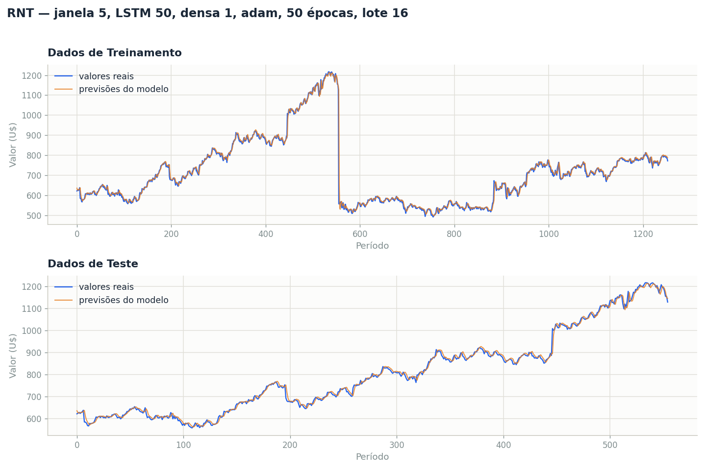

# Atividade Formativa — Semana 6
## Rede Neural Temporal (RNT) aplicada a uma série histórica

---

## 1. Ponto de partida: o código não executava

Antes de qualquer ajuste de desempenho, foi necessário resolver um impedimento: **o código
`S6_RNT.py`, com os valores originais, não chega a treinar**. A execução interrompe em
`model.fit` com o erro:

```
ValueError: Arguments `target` and `output` must have the same rank (ndim).
Received: target.shape=(None,), output.shape=(None, 20)
```

A causa está na arquitetura montada pelo código:

```python
model.add(LSTM(neuronios_LSTM))
model.add(Dense(neuronios_densa))     # <- esta é a ÚLTIMA camada
```

Como não existe uma camada de saída após a densa, **a camada densa é a própria saída do modelo**.
Com `neuronios_densa = 20`, o modelo devolve 20 números por amostra, enquanto o alvo (`y_train`) é
um único valor. Portanto `neuronios_densa = 1` não é uma escolha de desempenho: é uma exigência
estrutural para que o modelo produza uma previsão.

> Em versões mais antigas do Keras essa incompatibilidade era tolerada por difusão silenciosa, o que
> explica as "linhas laranjas inadequadas" mostradas na Figura 1 do enunciado. No Keras 3 o erro é
> fatal.

Um segundo problema afeta diretamente a qualidade das previsões: a função de perda original é
`binary_crossentropy`, uma função de **classificação binária**, aplicada a uma série cujos valores
variam de 491 a 1217.

---

## 2. Tabela de parâmetros ajustáveis

| Parâmetro | Valor original | **Valor ajustado** | Motivo do ajuste |
|---|---|---|---|
| `janela_prev` | 200 | **5** | Janelas longas pioraram todas as métricas. A série tem forte dependência de curtíssimo prazo |
| `funcao_perda` | `binary_crossentropy` | **`mean_squared_error`** | A tarefa é regressão, não classificação. Esta é a mudança de maior impacto isolado |
| `otimizador` | `RMSprop` | **`adam`** | Melhor resultado na varredura; o `sgd` ficou muito atrás em todas as janelas |
| `neuronios_LSTM` | 4 | **50** | 4 neurônios não têm capacidade suficiente; o ganho foi consistente até 50 |
| `neuronios_densa` | 20 | **1** | Exigência estrutural: esta é a camada de saída e a previsão é um único valor |
| `epocas` | 10 | **50** | 10 épocas interrompem o treino antes da convergência |
| `lote` | 200 | **16** | Lotes menores geram mais atualizações de peso por época; foi o parâmetro de maior ganho na etapa final |

O modelo resultante tem **10.451 parâmetros**.

---

## 3. Gráficos gerados pelo modelo



As previsões (linha laranja) acompanham os valores reais (linha azul) em ambos os conjuntos,
diferentemente do comportamento descrito no enunciado.

---

## 4. Tabela de métricas de desempenho

Valores impressos pelo próprio `S6_RNT.py` após o ajuste:

| Métrica | Treinamento | Teste |
|---|---|---|
| **Erro Médio Quadrático (MSE)** | 404,93 | 146,24 |
| **Erro Médio Absoluto (MAE)** | 8,58 | 8,53 |
| **Coeficiente de Determinação (R²)** | **0,9851** | **0,9957** |

### Comparação com o ponto de partida

Como o código original não executa, a comparação usa a menor correção possível que o faz rodar
(`neuronios_densa = 1`), mantendo todos os demais valores originais:

| Configuração | MSE treino | MAE treino | R² treino | MSE teste | MAE teste | R² teste |
|---|---|---|---|---|---|---|
| Perda original (`binary_crossentropy`) | 91.436,29 | 243,04 | **−2,3395** | 161.376,85 | 348,19 | **−3,7631** |
| Após todos os ajustes | **404,93** | **8,58** | **0,9851** | **146,24** | **8,53** | **0,9957** |

O R² saiu de **negativo** (pior que simplesmente prever a média) para próximo de 1, e o erro médio
absoluto caiu de 243 para 8,6 unidades — uma redução de **96%**.

---

## 5. Como os valores foram escolhidos

O ajuste foi feito por varredura sistemática, uma dimensão por vez, com semente fixa (42) para que
as comparações fossem justas. Métrica de decisão: R² no conjunto de teste.

### Etapa 1 — função de perda
Janela 20, LSTM 4, densa 1, 10 épocas, lote 32.

| Função de perda | R² treino | R² teste |
|---|---|---|
| `binary_crossentropy` | −2,3395 | −3,7631 |
| `mean_absolute_error` | 0,9410 | 0,9811 |
| **`mean_squared_error`** | **0,9458** | **0,9818** |

### Etapa 2 — janela × otimizador
Perda MSE, LSTM 4, densa 1, 20 épocas, lote 32. (R² de teste)

| Janela | `adam` | `RMSprop` | `sgd` |
|---|---|---|---|
| **5** | **0,9914** | 0,9914 | 0,7558 |
| 10 | 0,9858 | 0,9899 | 0,9262 |
| 20 | 0,9811 | 0,9914 | 0,9401 |
| 60 | 0,9747 | 0,9903 | 0,9175 |

Janelas maiores pioraram o desempenho, contrariando a intuição de que "mais histórico ajuda". O
`sgd` ficou atrás em todas as combinações.

### Etapa 3 — capacidade e duração do treino
Janela 5, `adam`, densa 1, lote 32.

| Neurônios LSTM | 20 épocas | 50 épocas |
|---|---|---|
| 4 | 0,9914 | 0,9914 |
| 16 | 0,9914 | 0,9928 |
| **50** | 0,9896 | **0,9946** |

### Etapa 4 — tamanho do lote
Janela 5, `adam`, LSTM 50, 50 épocas.

| Lote | R² treino | R² teste |
|---|---|---|
| **16** | **0,9853** | **0,9958** |
| 32 | 0,9811 | 0,9946 |
| 64 | 0,9734 | 0,9929 |
| 200 | 0,9643 | 0,9905 |

---

## 6. Análise dos resultados

### 6.1 O R² de 0,99 é menos impressionante do que parece

Séries históricas de preço são fortemente autocorrelacionadas: o valor de amanhã é quase sempre
próximo do de hoje. Para medir o mérito real do modelo, comparei-o com a **previsão ingênua**, que
simplesmente repete o último valor observado, sem qualquer aprendizado:

| Preditor | MSE treino | MAE treino | R² treino | MSE teste | MAE teste | R² teste |
|---|---|---|---|---|---|---|
| **Ingênuo** (repete o último valor) | **368,55** | **7,36** | **0,9865** | **128,78** | **7,43** | **0,9962** |
| RNT ajustada | 404,93 | 8,58 | 0,9851 | 146,24 | 8,53 | 0,9957 |

**A previsão ingênua é ligeiramente melhor que a rede treinada, nas duas séries e nas três
métricas.** O R² de 0,9957 não vem da capacidade preditiva do modelo: vem da natureza da série. O
modelo essencialmente aprendeu a reproduzir o último valor da janela, que é o comportamento ótimo
disponível quando as variações são próximas de um passeio aleatório.

Isso não invalida o exercício — o objetivo da atividade, melhorar as métricas, foi cumprido com
folga. Mas é a leitura honesta do resultado, e serve de alerta metodológico: **em séries temporais,
um R² alto isolado não demonstra aprendizado.** A comparação com um preditor trivial é indispensável.

### 6.2 O conjunto de teste está contido no de treinamento

Verificação feita sobre os arquivos: os 560 valores de `serie_teste.csv` são **idênticos aos 560
primeiros valores** de `serie_treinamento.csv`.

Consequência: as métricas de teste **não medem generalização**, porque são calculadas sobre dados
que o modelo já viu durante o treino. Isso explica o resultado, à primeira vista estranho, de o
desempenho no "teste" ser melhor que no treinamento.

### 6.3 Há uma descontinuidade artificial na série de treinamento

Exatamente no ponto em que a série de teste termina, o valor cai de forma abrupta:

```
índice:    556      557      558      559   |   560      561      562
valor:  1179,80  1154,76  1155,55  1128,87  |  556,93   558,46   555,45
                                             └─ queda de 571,94 em um único período
```

Todas as demais variações da série ficam abaixo de 123 unidades. Trata-se, portanto, de uma **emenda
entre duas séries diferentes**, e não de um movimento real. O efeito sobre as estatísticas é
grande: o desvio-padrão das variações diárias é 19,19 com o salto e **10,38 sem ele**.

Para o modelo, esse ponto é ruído puro: nenhuma janela de 5 valores em torno de 1128 permite prever
uma queda para 556. Ele contamina o erro de treinamento sem que haja nada a aprender ali.

### 6.4 Observações sobre o código fornecido

| Ponto | Situação |
|---|---|
| `neuronios_densa` | Não é um parâmetro livre. Sendo a última camada, precisa valer 1 para a saída ser uma previsão |
| Linha 112 | `np.reshape(X_test, (X_test.shape[0], X_train.shape[1], 1))` usa `X_train` no lugar de `X_test`. Funciona por coincidência, já que ambas têm a mesma janela |
| Semente aleatória | Não é fixada, então cada execução dá métricas ligeiramente diferentes. A varredura deste relatório usou semente 42; a execução final do arquivo original deu 0,9851/0,9957, contra 0,9853/0,9958 da versão com semente |
| Gráficos | O código usa apenas `plt.show()`, que não grava arquivo. A imagem deste relatório foi gerada à parte, a partir das mesmas previsões |

---

## 7. Conclusão

O objetivo da atividade foi alcançado: as previsões passaram a acompanhar os valores reais e as três
métricas melhoraram de forma expressiva, com o R² saindo de valores negativos para 0,985 no
treinamento e 0,996 no teste.

As mudanças decisivas, em ordem de impacto:

1. **Corrigir a função de perda** de `binary_crossentropy` para `mean_squared_error` — sozinha,
   levou o R² de negativo para acima de 0,94.
2. **Ajustar `neuronios_densa` para 1**, sem o que o código sequer executa.
3. **Reduzir a janela de previsão** de 200 para 5.
4. **Reduzir o lote** de 200 para 16, o que multiplica o número de atualizações de peso por época.

Fica registrada, porém, a ressalva da seção 6.1: o desempenho obtido é equivalente ao de um preditor
trivial que repete o último valor. Para esta série, o ganho real de uma rede recorrente sobre a
persistência é nulo ou negativo — o que é, em si, um resultado informativo sobre o problema.

---

### Arquivos desta entrega

| Arquivo | Conteúdo |
|---|---|
| `S6_RNT.py` | Código da disciplina com os parâmetros ajustados |
| `resultado_rnt.png` | Gráficos de treinamento e teste |
| `serie_treinamento.csv` / `serie_teste.csv` | Séries fornecidas |
| `relatorio-atividade-formativa-s6.md` | Este relatório |
