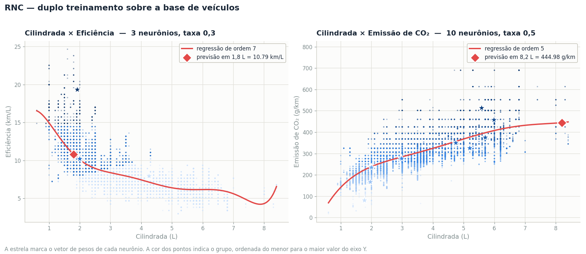
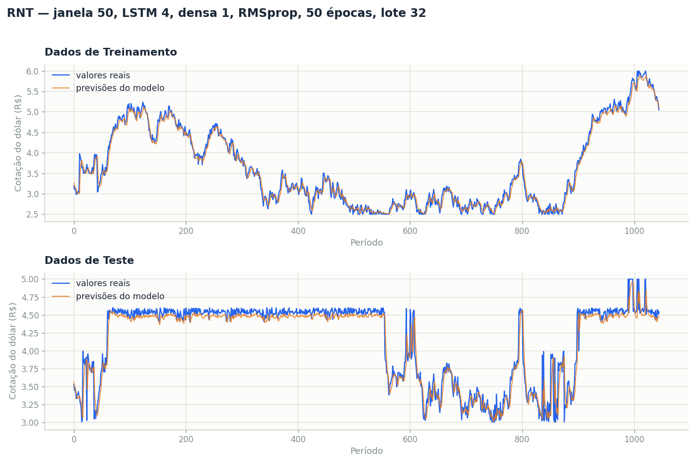

# Atividade Formativa — Semana 7
## Duplo treinamento: Rede Neural Competitiva (RNC) e Rede Neural Temporal (RNT)

---

# PARTE 1 — Rede Neural Competitiva

## 1.1 Ponto de partida

O enunciado aponta dois problemas, e a execução do código original confirma ambos:

**O número de grupos não corresponde ao número de neurônios.**

| Rede | Neurônios definidos | Grupos que apareceram | Tamanho dos grupos |
|---|---|---|---|
| RNC 1 (Cilindrada × Eficiência) | 4 | **3** | 30.238 / 7.724 / 5 |
| RNC 2 (Cilindrada × CO₂) | 8 | **4** | 36.445 / 1.470 / 47 / 5 |

Na RNC 2, **36.445 dos 37.967 veículos (96%) caíram num único grupo**, e metade dos neurônios
nunca venceu uma única vez.

**As linhas de regressão não representam os dados.** A primeira era de ordem 1 (uma reta para uma
relação claramente curva) e a segunda de ordem 10, com coeficientes instáveis.

### Por que os neurônios morrem

A causa é estrutural e vale registrar. Os pesos são inicializados por `np.random.rand`, ou seja,
**sempre dentro do quadrado [0,1) × [0,1)**. Mas os dados estão em outra região do espaço:

| Par de variáveis | Faixa do eixo 1 | Faixa do eixo 2 |
|---|---|---|
| Cilindrada × Eficiência | 0,60 a 8,40 L | 2,98 a 24,66 km/L |
| Cilindrada × CO₂ | 0,60 a 8,40 L | **18,02 a 788,88 g/km** |

Todo neurônio nasce **abaixo da nuvem de dados**. Só os que por acaso nasceram mais próximos
conseguem vencer; os demais nunca são atualizados e ficam congelados na posição inicial.

E há um agravante na RNC 2: a amplitude do CO₂ é **98,8 vezes maior** que a da cilindrada. Como a
distância euclidiana soma os dois eixos sem ponderação, o CO₂ domina a decisão quase por completo.

## 1.2 Tabela de parâmetros ajustados

| Parâmetro | Valor original | **Valor ajustado** | Motivo |
|---|---|---|---|
| `num_neur_rnc1` | 4 | **3** | Com 4 ou mais, algum grupo sempre ficava vazio |
| `num_neur_rnc2` | 8 | **10** | Aqui o oposto: a faixa ampla do CO₂ comporta 10 grupos sem nenhum vazio |
| `epocas_rnc1` | 10 | **10** | Mantido; épocas não alteram o resultado (ver 1.5) |
| `epocas_rnc2` | 1 | **10** | Pequena melhora do erro, de 12,823 para 12,714 |
| `taxa_aprend_rnc1` | 0,01 | **0,3** | Com 0,01 dois neurônios morriam |
| `taxa_aprend_rnc2` | 2,00 | **0,5** | Taxa acima de 1 é destrutiva (ver 1.5) |
| `ordem_pol1` | 1 | **7** | Uma reta não representa a curva de eficiência |
| `ordem_pol2` | 10 | **5** | A ordem 10 é instável; a 5 prevê melhor e não produz valores negativos |
| `cilindrada1_info` | 1,8 L | 1,8 L | É a pergunta da atividade, não um parâmetro de ajuste |
| `cilindrada2_info` | 8,2 L | 8,2 L | Idem |

## 1.3 Gráficos gerados pelos modelos



A estrela marca o vetor de pesos de cada neurônio, que pode ser lido como "o veículo típico" daquele
grupo. A cor indica o grupo, ordenada do menor para o maior valor do eixo vertical.

## 1.4 Tabelas de agrupamento

### RNC 1 — Cilindrada × Eficiência (3 neurônios, taxa 0,3)

| Grupo | Cil. (min) | Cil. (max) | Efic. (min) | Efic. (max) | Elementos |
|---|---|---|---|---|---|
| Pequenos e eficientes | 0,6 | 2,5 | 14,88 | 24,66 | 467 |
| Intermediários | 0,9 | 4,3 | 7,23 | 14,45 | 14.659 |
| Motores grandes | 1,3 | 8,4 | 2,98 | 10,20 | 22.841 |

### RNC 2 — Cilindrada × CO₂ (10 neurônios, taxa 0,5)

| Grupo | Cil. (min) | Cil. (max) | CO₂ (min) | CO₂ (max) | Elementos |
|---|---|---|---|---|---|
| 1 | 0,6 | 3,6 | 18,02 | 123,03 | 101 |
| 2 | 0,9 | 4,6 | 123,65 | 200,70 | 2.669 |
| 3 | 1,0 | 6,0 | 201,32 | 255,38 | 9.154 |
| 4 | 1,0 | 6,2 | 256,01 | 300,74 | 10.206 |
| 5 | 1,1 | 7,0 | 301,22 | 336,78 | 6.198 |
| 6 | 1,9 | 8,4 | 337,41 | 361,02 | 2.452 |
| 7 | 1,9 | 8,4 | 362,88 | 416,32 | 4.463 |
| 8 | 2,4 | 8,3 | 416,94 | 473,49 | 2.035 |
| 9 | 2,9 | 8,3 | 485,91 | 613,57 | 649 |
| 10 | 4,7 | 6,8 | 690,27 | 788,88 | 40 |

**Os 10 grupos estão todos ocupados**, contra 4 de 8 na configuração original.

## 1.5 Funções polinomiais e previsões

**Cilindrada × Eficiência (ordem 7):**

```
f(x) = 0,00x⁷ − 0,06x⁶ + 0,79x⁵ − 5,05x⁴ + 17,37x³ − 30,65x² + 20,32x + 12,22
```

| | Valor |
|---|---|
| Cilindrada informada | **1,8 L** |
| **Eficiência prevista** | **10,79 km/L** |
| Média real dos veículos entre 1,7 e 1,9 L | 10,88 km/L (2.087 veículos) |

**Cilindrada × Emissão de CO₂ (ordem 5):**

```
f(x) = 0,13x⁵ − 3,39x⁴ + 32,92x³ − 150,10x² + 364,00x − 102,05
```

| | Valor |
|---|---|
| Cilindrada informada | **8,2 L** |
| **Emissão de CO₂ prevista** | **444,98 g/km** |
| Média real dos veículos entre 8,0 e 8,4 L | 440,37 g/km (43 veículos) |

As duas previsões ficam a **menos de 1,1% da média real** observada naquela faixa de cilindrada.

## 1.6 Como os valores foram escolhidos

Varredura de 30 configurações por rede (6 valores de k × 5 taxas), com 3 sementes cada. Critério
declarado antes de ver os números: descartar configurações que deixem grupo vazio, depois menor erro
de quantização, desempate pelo menor k.

| | RNC 1 | RNC 2 |
|---|---|---|
| Configurações sem nenhum grupo vazio | **5 de 30** | **25 de 30** |
| Escolhida | k = 3, taxa 0,3 | k = 10, taxa 0,5 |
| Erro de quantização | 1,473 | 12,714 |

A diferença entre as duas colunas é reveladora: com o CO₂, que tem faixa muito ampla, é **mais
fácil** manter todos os neurônios ativos, porque há mais espaço para cada um ocupar.

**Taxa de aprendizado acima de 1 é destrutiva.** A conta explica: `w + η·(x − w)` com η = 2 resulta
em `2x − w`, que fica à **mesma distância** do dado, do lado oposto. O neurônio nunca converge, ele
ricocheteia. Era o valor original da RNC 2.

**Épocas praticamente não alteram o resultado.** Para a RNC 1, o erro foi 1,473 com 1, 5, 10 ou 20
épocas. Motivo: com taxa constante e sem decaimento, o modelo "lembra" apenas das últimas ~1/η
amostras, então percorrer a base de novo termina no mesmo lugar.

**Ordem dos polinômios, validada contra a realidade** e não pelo R² (que sempre premia ordem maior).
Comparei cada ordem com a média real de eficiência e de CO₂ por faixa de cilindrada:

| Ordem | Erro vs média por faixa (Efic.) | Erro vs média por faixa (CO₂) | CO₂ previsto em 0,6 L |
|---|---|---|---|
| 1 | 1,232 | 25,719 | 176,50 |
| 5 | 0,326 | **16,794** | 69,00 |
| **7** | **0,273** | 14,483 | 218,71 |
| 9 | 0,229 | 11,873 | **−35,26** |
| 10 | 0,277 | 13,104 | 40,33 |

A ordem 9 tem o menor erro nas faixas para o CO₂, mas **prevê emissão negativa** em 0,6 L, o que é
fisicamente impossível. Por isso a escolha recaiu na ordem 5, que prevê 444,98 g/km contra 440,37
reais e permanece positiva em toda a faixa.

> **Ressalva honesta:** a curva de ordem 7 da eficiência apresenta uma leve oscilação acima de
> 7,5 L, região com pouquíssimos veículos. É visível no gráfico. A ordem 5 seria mais suave ali,
> mas erra bem mais na ponta baixa (19,82 contra 16,16 km/L reais). A escolha privilegiou a região
> onde estão os dados.

## 1.7 Análise dos resultados da RNC

**Os grupos da RNC 2 são faixas puras de CO₂.** Observe a tabela 1.4: as faixas de CO₂ são limpas e
não se sobrepõem (18–123, 124–200, 201–255, …), enquanto a cilindrada se sobrepõe inteiramente — o
grupo 7 vai de 1,9 a 8,4 L, praticamente a base toda. Ou seja, **a rede ignorou a cilindrada**.

Isso não é defeito do treinamento, é consequência direta da falta de normalização: com o CO₂ tendo
amplitude 98,8 vezes maior, ele domina a distância euclidiana. Um agrupamento que levasse as duas
variáveis em conta exigiria normalizar os eixos antes de treinar — o que mudaria o código, e não
apenas seus parâmetros.

O mesmo fenômeno aparece, em escala menor, na RNC 1: a razão de amplitudes é 2,8× e os grupos também
se separam sobretudo por eficiência.

---

# PARTE 2 — Rede Neural Temporal

## 2.1 Ponto de partida: o código não executava

Assim como na atividade da semana 6, o código original **não chega a treinar**:

```
ValueError: Arguments `target` and `output` must have the same rank (ndim).
Received: target.shape=(None,), output.shape=(None, 5)
```

A arquitetura é `LSTM → Dense(neuronios_densa)` **sem camada de saída depois**, portanto a camada
densa é a própria saída. Com `neuronios_densa = 5`, o modelo devolve 5 números por amostra enquanto
o alvo é um único valor. **`neuronios_densa = 1` não é escolha de desempenho, é exigência
estrutural.**

Além disso, a função de perda original é `binary_crossentropy`, própria de classificação binária,
aplicada a uma série de regressão que vale entre 2,50 e 6,00.

## 2.2 Tabela de parâmetros ajustados

| Parâmetro | Valor original | **Valor ajustado** | Motivo |
|---|---|---|---|
| `janela_prev` | 50 | **50** | Mantido; foi o melhor valor na varredura |
| `funcao_perda` | `binary_crossentropy` | **`mean_squared_error`** | A tarefa é regressão |
| `otimizador` | `sgd` | **`RMSprop`** | O `sgd` ficou atrás em todas as janelas testadas |
| `neuronios_LSTM` | 2 | **4** | Acima de 4 o desempenho no teste piorou (série curta) |
| `neuronios_densa` | 5 | **1** | Exigência estrutural: é a camada de saída |
| `epocas` | 5 | **50** | 5 épocas interrompem o treino muito cedo |
| `lote` | 20 | **32** | Pequena melhora sobre 16 e 64 |

O modelo resultante tem apenas **101 parâmetros**.

## 2.3 Gráficos de treinamento e teste



## 2.4 Tabela de métricas de desempenho

Valores impressos pelo próprio `S7_RNT.py` após o ajuste:

| Métrica | Treinamento | Teste |
|---|---|---|
| **Erro Médio Quadrático (MSE)** | 0,0138 | 0,0215 |
| **Erro Médio Absoluto (MAE)** | 0,0879 | 0,0814 |
| **Coeficiente de Determinação (R²)** | **0,9854** | **0,9294** |

### Comparação com o ponto de partida

Como o código original não executa, a comparação usa a menor correção que o faz rodar
(`neuronios_densa = 1`), mantendo os demais valores originais:

| Configuração | R² treino | R² teste |
|---|---|---|
| Perda original (`binary_crossentropy`, `sgd`, LSTM 2, 5 épocas) | 0,9384 | **0,7903** |
| Após todos os ajustes | **0,9854** | **0,9294** |

## 2.5 Como os valores foram escolhidos

Varredura sequencial com semente fixa. Etapas e melhor R² de teste em cada uma:

| Etapa | Resultado |
|---|---|
| 1. Função de perda | `mean_squared_error` e `mean_absolute_error` muito à frente da `binary_crossentropy` |
| 2. Janela × otimizador | janela 50 + `RMSprop` → 0,9094 |
| 3. Neurônios × épocas | LSTM 4 + 50 épocas → 0,9248 (LSTM 16 e 50 **pioraram**) |
| 4. Lote | lote 32 → 0,9248 |

Dois pontos de método que valem registro:

- **Mais neurônios pioraram o resultado.** LSTM 50 deu R² de teste 0,9102 contra 0,9248 do LSTM 4.
  A série tem apenas 1.095 pontos; capacidade em excesso leva o modelo a decorar o treino.
- **A busca sequencial tem um ponto cego.** Na etapa 1, a perda `mean_absolute_error` parecia melhor
  que a `mean_squared_error` (R² de teste 0,8824 contra 0,8367), mas a busca seguiu com MSE fixo.
  Refiz a comparação no ponto de chegada, com 3 sementes: **0,9265 para MSE e 0,9267 para MAE** — ou
  seja, a diferença desapareceu depois que os demais parâmetros foram ajustados. A escolha da MSE
  ficou confirmada, mas só porque foi reconferida.

## 2.6 Análise dos resultados da RNT

### O modelo empata com a previsão ingênua

Séries de câmbio são fortemente autocorrelacionadas. Para medir o mérito real do modelo, comparei-o
com a **previsão ingênua**, que simplesmente repete o último valor observado:

| Preditor | MSE treino | MAE treino | R² treino | MSE teste | MAE teste | R² teste |
|---|---|---|---|---|---|---|
| **Ingênuo** (repete o último valor) | 0,01047 | **0,0753** | **0,9890** | 0,02276 | **0,0772** | 0,9251 |
| RNT ajustada | **0,0138** | 0,0879 | 0,9854 | **0,0215** | 0,0814 | **0,9294** |

O resultado é um **empate técnico**: a RNT leva vantagem no erro quadrático e no R² do teste, e a
previsão ingênua leva no erro absoluto, nas duas séries. A rede aprendeu essencialmente a reproduzir
o último valor da janela, com um pequeno ajuste que ajuda nos períodos de movimento forte e atrapalha
nos de calmaria.

Vale mais que a métrica isolada: **um R² de 0,93 numa série temporal não demonstra, por si só, que o
modelo aprendeu alguma coisa.** A comparação com um preditor trivial é indispensável.

### O conjunto de teste é mais difícil que o de treinamento

Diferentemente da atividade da semana 6, aqui treino e teste são séries **distintas** (verificado:
uma não é prefixo da outra). E a de teste é sensivelmente mais difícil:

| | Treinamento | Teste |
|---|---|---|
| Pontos | 1.095 | 1.095 |
| Faixa | 2,50 a 6,00 | 3,00 a 5,00 |
| **Desvio das variações de um período para o outro** | 0,1031 | **0,1557 (+51%)** |
| Maior variação em um único período | 0,97 | 0,99 |

É isso que explica a diferença entre R² de 0,985 no treino e 0,929 no teste: não é sobreajuste, é
uma série de teste 51% mais volátil. Variações de quase 1 real em um único período são atípicas para
câmbio, e o valor exato 5,00 aparece 13 vezes na série de teste, o que sugere algum arredondamento
ou teto nos dados.

---

# 3. Conclusão geral

Os dois objetivos da atividade foram alcançados.

**Na RNC**, o número de grupos passou a corresponder ao número de neurônios nas duas redes (3 de 3 e
10 de 10, contra 3 de 4 e 4 de 8), e as regressões passaram a acompanhar a dispersão dos dados, com
previsões a menos de 1,1% da média real observada.

**Na RNT**, o R² de teste subiu de 0,7903 para 0,9294, e o código passou a executar.

As três lições que ficam:

1. **Taxa de aprendizado acima de 1 não é "aprender rápido", é não aprender.** O peso ricocheteia em
   torno do dado em vez de convergir.
2. **Sem normalização, quem decide o agrupamento é a unidade de medida.** Na RNC 2, o CO₂ tem
   amplitude 98,8 vezes maior que a cilindrada e a rede simplesmente ignorou a segunda variável.
3. **Métrica boa não é sinônimo de modelo bom.** A RNT alcançou R² de 0,93, mas empata com um
   preditor que apenas repete o último valor.

---

### Observações sobre o código fornecido

| Ponto | Situação |
|---|---|
| `neuronios_densa` (RNT) | Não é parâmetro livre: sendo a última camada, precisa valer 1 |
| Nome do arquivo | O enunciado pede "S7_RNC.py"; o arquivo entregue chama-se `S7_RCN.py` |
| Linha 112 (RNT) | `np.reshape(X_test, (X_test.shape[0], X_train.shape[1], 1))` usa `X_train` no lugar de `X_test`. Funciona por coincidência, pois ambas têm a mesma janela |
| Semente aleatória | Não é fixada; cada execução dá números levemente diferentes. As varreduras deste relatório usaram semente fixa, e as tabelas finais vêm da execução dos arquivos originais |
| Gráficos | Os códigos usam apenas `plt.show()`, que não grava arquivo. As imagens deste relatório foram geradas à parte, a partir das mesmas previsões |

### Arquivos desta entrega

| Arquivo | Conteúdo |
|---|---|
| `S7_RCN.py` | Código da RNC com os parâmetros ajustados |
| `S7_RNT.py` | Código da RNT com os parâmetros ajustados |
| `resultado_rnc.png` | Gráficos das duas redes competitivas |
| `resultado_rnt.png` | Gráficos de treinamento e teste da rede temporal |
| `relatorio-atividade-formativa-s7.md` | Este relatório |
