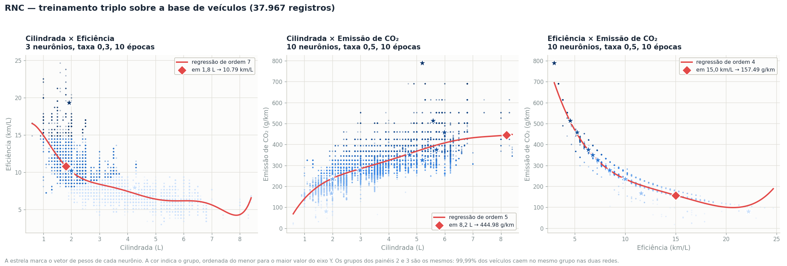
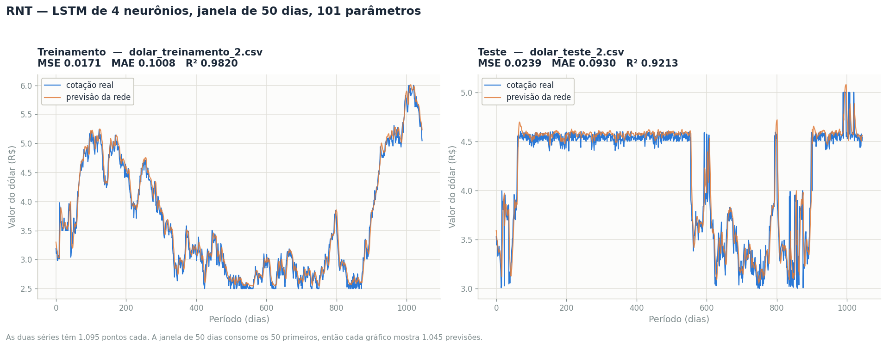

# Atividade Somativa 2 — Redes Neurais

**Unidade 08 — Rede Neural Competitiva (RNC) e Rede Neural Temporal (RNT)**

Arquivos executados: [S8_RCN.py](S8_RCN.py), [S8_RNT_train.py](S8_RNT_train.py) e
[S8_RNT_test.py](S8_RNT_test.py), com as bases [base_veiculos_2.csv](base_veiculos_2.csv),
[dolar_treinamento_2.csv](dolar_treinamento_2.csv) e [dolar_teste_2.csv](dolar_teste_2.csv)
copiadas para `C:\RN\`, caminho fixo esperado pelos códigos.

---

## Parte 1 — Rede Neural Competitiva

### 1.1 O que estava errado no ponto de partida

O enunciado afirma que "o número de grupos encontrados não está de acordo com o número de
neurônios definido na estrutura do modelo". A execução confirma, e a causa tem nome:

**Neurônios mortos ao nascer.** A classe `RNC` inicializa os pesos com
`np.random.rand(num_neurons, input_shape)`, que sorteia valores no quadrado [0,1)². Mas os dados
não moram lá: a eficiência começa em 2,98 km/L e o CO₂ em 18,02 g/km. Todos os neurônios nascem
num canto vazio do espaço, abaixo da nuvem de pontos. O que estiver marginalmente mais perto vence
sempre, e os demais nunca são atualizados — continuam no canto até o fim do treinamento e não
recebem nenhum veículo.

**Taxa de aprendizado destrutiva.** `taxa_aprend_rnc2 = 2,00` e `taxa_aprend_rnc3 = 1,00`. A regra
de atualização é `w ← w + η·(x − w)`. Com η = 1 o peso salta exatamente para cima do dado, apagando
toda a memória das amostras anteriores. Com η = 2 o resultado é `2x − w`: o neurônio vai parar do
lado oposto do dado, à mesma distância. Não é um passo grande demais — é um passo na direção errada.

**Uma época não treina nada.** `epocas_rnc2 = epocas_rnc3 = 1`. Como o código não reduz η ao longo
do tempo, a única forma de os neurônios se acomodarem é ver os dados repetidas vezes.

**Ordem 1 para uma relação que não é reta.** `ordem_pol1 = 1` ajusta uma reta a uma nuvem
claramente curva (cilindrada × eficiência cai rápido e depois achata), e `ordem_pol2 = 10` faz o
oposto: oscila nos extremos, onde há poucos dados.

### 1.2 Parâmetros ajustados

| Parâmetro | Original | Ajustado |
|---|---|---|
| `num_neur_rnc1` | 4 | **3** |
| `num_neur_rnc2` | 8 | **10** |
| `num_neur_rnc3` | 4 | **10** |
| `epocas_rnc1` | 10 | 10 |
| `epocas_rnc2` | 1 | **10** |
| `epocas_rnc3` | 1 | **10** |
| `taxa_aprend_rnc1` | 0,01 | **0,30** |
| `taxa_aprend_rnc2` | 2,00 | **0,50** |
| `taxa_aprend_rnc3` | 1,00 | **0,50** |
| `ordem_pol1` | 1 | **7** |
| `ordem_pol2` | 10 | **5** |
| `ordem_pol3` | 6 | **4** |

**Como foram escolhidos.** Varredura de 30 configurações por rede (6 valores de neurônios × 5 taxas),
cada uma repetida com 3 inicializações diferentes — 270 treinamentos ao todo. O critério foi
declarado antes de olhar os números: *descartar toda configuração que deixe algum grupo vazio*
(é exatamente a falha que o enunciado aponta), *depois* escolher o menor erro médio de quantização,
com desempate pelo menor número de neurônios.

Um resultado contraintuitivo apareceu: na rede 1 apenas **5 das 30 configurações** evitam grupo
vazio, contra **25 das 30** nas redes 2 e 3. A faixa ampla do CO₂ dá muito mais espaço para os
neurônios se espalharem; no par cilindrada × eficiência, os dados ocupam uma região estreita e os
neurônios disputam o mesmo espaço.

### 1.3 Gráficos gerados



As estrelas marcam os vetores de pesos. A cor indica o grupo, ordenada do menor para o maior valor
do eixo Y. O código da disciplina só chama `plt.show()`, que não grava arquivo; a figura foi gerada
à parte reproduzindo o mesmo algoritmo.

### 1.4 Tabelas de agrupamento

Saída literal do código, com as linhas reordenadas pela faixa do eixo Y para deixar a estrutura
visível. A coluna `Group` preserva o rótulo original — ele é arbitrário, depende de qual neurônio
foi sorteado onde.

**Tabela 1 — Cilindrada (L) × Eficiência (km/L), 3 neurônios**

| Group | Cil. (min) | Cil. (max) | Efic. (min) | Efic. (max) | Elementos |
|---|---|---|---|---|---|
| 1 | 1,3 | 8,4 | 2,98 | 10,20 | 22.841 |
| 0 | 0,9 | 4,3 | 7,23 | 14,45 | 14.659 |
| 2 | 0,6 | 2,5 | 14,88 | 24,66 | 467 |

**Tabela 2 — Cilindrada (L) × Emissão de CO₂ (g/km), 10 neurônios**

| Group | Cil. (min) | Cil. (max) | CO₂ (min) | CO₂ (max) | Elementos |
|---|---|---|---|---|---|
| 2 | 0,6 | 3,6 | 18,02 | 123,03 | 101 |
| 9 | 0,9 | 4,6 | 123,65 | 200,70 | 2.669 |
| 5 | 1,0 | 6,0 | 201,32 | 255,38 | 9.154 |
| 0 | 1,0 | 6,2 | 256,01 | 300,74 | 10.206 |
| 7 | 1,1 | 7,0 | 301,22 | 336,78 | 6.198 |
| 1 | 1,9 | 8,4 | 337,41 | 361,02 | 2.452 |
| 4 | 1,9 | 8,4 | 362,88 | 416,32 | 4.463 |
| 6 | 2,4 | 8,3 | 416,94 | 473,49 | 2.035 |
| 8 | 2,9 | 8,3 | 485,91 | 613,57 | 649 |
| 3 | 4,7 | 6,8 | 690,27 | 788,88 | 40 |

**Tabela 3 — Eficiência (km/L) × Emissão de CO₂ (g/km), 10 neurônios**

| Group | Efic. (min) | Efic. (max) | CO₂ (min) | CO₂ (max) | Elementos |
|---|---|---|---|---|---|
| 8 | 8,50 | 24,66 | 18,02 | 121,79 | 98 |
| 2 | 8,93 | 18,71 | 123,03 | 200,70 | 2.672 |
| 6 | 7,65 | 13,18 | 201,32 | 255,38 | 9.154 |
| 0 | 5,53 | 10,63 | 256,01 | 300,74 | 10.206 |
| 7 | 5,95 | 8,93 | 301,22 | 336,78 | 6.198 |
| 9 | 5,53 | 7,65 | 337,41 | 361,02 | 2.452 |
| 4 | 4,68 | 7,23 | 362,88 | 416,32 | 4.463 |
| 5 | 4,25 | 6,38 | 416,94 | 473,49 | 2.035 |
| 3 | 3,83 | 4,68 | 485,91 | 613,57 | 649 |
| 1 | 2,98 | 3,40 | 690,27 | 788,88 | 40 |

As três tabelas têm agora tantos grupos quanto neurônios, e todos os grupos são povoados — o menor
tem 40 veículos. O problema que o enunciado aponta está resolvido.

### 1.5 Funções polinomiais geradas

Como o código imprime os coeficientes com duas casas decimais, o termo de maior grau da primeira
função aparece como `0.00x^7`. Ele não é zero: vale 0,0021. Abaixo, as três funções com precisão
suficiente para serem reproduzidas.

**Cilindrada × Eficiência (ordem 7)**

```
f(x) = 0,0021x⁷ − 0,0644x⁶ + 0,7947x⁵ − 5,0467x⁴ + 17,3714x³ − 30,6454x² + 20,3207x + 12,2220
```

**Cilindrada × Emissão de CO₂ (ordem 5)**

```
f(x) = 0,1306x⁵ − 3,3924x⁴ + 32,9216x³ − 150,1048x² + 363,9978x − 102,0457
```

**Eficiência × Emissão de CO₂ (ordem 4)**

```
f(x) = 0,0187x⁴ − 1,1177x³ + 24,9736x² − 261,0505x + 1278,8758
```

### 1.6 Previsão de eficiência

| | |
|---|---|
| Cilindrada informada | **1,8 L** |
| Eficiência prevista | **10,79 km/L** |
| Média real dos veículos entre 1,71 e 1,89 L | 10,65 km/L (1.593 veículos) |
| Erro | **1,3%** |

### 1.7 Previsão da emissão de CO₂

Duas previsões, porque esta atividade acrescentou a terceira rede.

| | A partir da cilindrada | A partir da eficiência |
|---|---|---|
| Valor informado | **8,2 L** | **15,0 km/L** |
| CO₂ previsto | **444,98 g/km** | **157,49 g/km** |
| Média real na vizinhança (±5%) | 440,37 g/km (43 veículos) | 163,03 g/km (333 veículos) |
| Erro | **1,0%** | **3,4%** |

### 1.8 Análise dos resultados

#### As redes 2 e 3 encontraram exatamente o mesmo agrupamento

Comparando as tabelas 2 e 3, as dez faixas de CO₂ são idênticas até a segunda casa decimal.
Isso não é coincidência. Rotulando os grupos das duas redes pela ordem de CO₂ e comparando veículo
a veículo, **37.964 dos 37.967 registros (99,99%) caem no mesmo grupo nas duas redes**. Apenas três
veículos mudam de lado, e todos na fronteira entre os dois grupos menos populosos.

Trocar a cilindrada pela eficiência no eixo X não alterou o resultado porque **a rede nunca usou o
eixo X**. A competição se decide pela distância euclidiana `‖x − w‖`, que soma as diferenças dos
dois eixos sem ponderação. A amplitude do CO₂ é 770,86 g/km; a da cilindrada, 7,8 L; a da
eficiência, 21,68 km/L. Uma diferença de 100 g/km de CO₂ pesa na conta o mesmo que uma diferença de
100 L de cilindrada — que não existe. O eixo de maior amplitude domina a soma, e os outros viram
ruído.

A prova está nas próprias tabelas: as faixas de CO₂ não se sobrepõem em nenhum ponto, enquanto as
do eixo X se sobrepõem por completo. Um único grupo da tabela 2 vai de 1,9 a 8,4 L — **83% de toda
a amplitude da cilindrada**. Na tabela 3, um grupo cobre 75% da amplitude da eficiência. Os grupos
são faixas puras de CO₂, nada mais.

Isso não é defeito do código, é a geometria do algoritmo. A correção seria normalizar as duas
colunas para a mesma escala antes de treinar, e aí sim a rede consideraria os dois atributos. Vale
registrar que o enunciado não pede normalização, e o resultado continua interpretável — só não é o
que o nome "Cilindrada × CO₂" sugere.

#### A terceira relação não é estatística, é física

A regressão eficiência × CO₂ tem R² de 0,9872 já na ordem 4. As outras duas não passam de 0,65 nem
com ordem 10. A diferença é grande demais para ser sorte, e a explicação está nas unidades.

Multiplicando as duas colunas: eficiência (km/L) × CO₂ (g/km) = **g de CO₂ por litro de
combustível**. Medido sobre os 37.967 veículos, esse produto vale **2.353,8 ± 77,0 g/L** — uma
variação de apenas 3,3% numa base que cobre de subcompactos a picapes de 8,4 L.

O valor de referência da EPA para a gasolina é 2.348 g de CO₂ por litro queimado. A base **calcula**
a emissão a partir do consumo usando esse fator; não a mede. Por isso a relação é quase
determinística: `CO₂ ≈ 2.354 / eficiência`.

Essa hipérbole de **um único parâmetro** atinge R² de 0,9884 — praticamente o mesmo que o polinômio
de ordem 10, que tem onze coeficientes (0,9886). O polinômio não descobriu nada que a física já não
dissesse; apenas gastou dez graus de liberdade para imitar uma curva 1/x.

E imita mal nos extremos, porque um polinômio não tem assíntota. É por isso que a ordem 3, apesar de
ter o segundo menor erro no corpo dos dados, foi descartada: ela prevê **CO₂ negativo (−98,66 g/km)**
para veículos de 24,66 km/L. A ordem 4 foi a menor que combina bom ajuste no corpo da distribuição
com valores fisicamente possíveis em toda a faixa.

#### Como as ordens dos polinômios foram escolhidas

Não pelo R², que sempre sobe quando se adiciona um grau. O critério foi comparar a curva com a
**média real do CO₂ (ou da eficiência) por faixa do eixo X**, em 16 faixas, e depois checar o
comportamento nos extremos.

Para cilindrada × CO₂ isso muda a resposta. A ordem 9 tem o menor erro contra as faixas (13,76),
mas prevê **−35,26 g/km** para um motor de 0,6 L — está desqualificada. Entre as candidatas viáveis:

| Ordem | Previsão em 8,2 L | Em 0,6 L (real: 22,68) | Em 8,4 L (real: 424,47) | Erro somado nos extremos |
|---|---|---|---|---|
| **5** | 444,98 | 69,00 | 448,16 | **70 g/km** |
| 7 | 467,07 | 218,71 | 376,52 | 244 g/km |
| 9 | 446,63 | −35,26 | 383,34 | desqualificada |

A ordem 5 erra três vezes menos nas pontas que a 7. Para cilindrada × eficiência, a ordem 7 teve o
menor erro contra as faixas (0,294, empatada com a ordem 9) e é a mais simples das duas.

Uma ressalva honesta: a curva de ordem 7 oscila levemente acima de 7,5 L, onde a base tem poucos
veículos. A previsão pedida (1,8 L) está no centro dos dados, onde a curva é confiável, mas ela não
deveria ser usada para extrapolar.

#### O resultado é estável

O código não fixa semente aleatória, então cada execução parte de pesos diferentes. Ainda assim, a
execução final do `S8_RCN.py` reproduziu **exatamente** as mesmas faixas que a varredura havia
encontrado com semente fixa — mesmos limites de CO₂, mesmas contagens. Só os rótulos numéricos dos
grupos mudaram de posição. Com os parâmetros ajustados, a rede converge para a mesma solução
independentemente de onde os neurônios nascem, que é precisamente o que não acontecia antes.

---

## Parte 2 — Rede Neural Temporal

### 2.1 O que estava errado no ponto de partida

**O código original não executa.** `neuronios_densa = 50` faz da última camada uma `Dense(50)`, que
devolve 50 números por amostra. O alvo é um número só — a cotação do dia seguinte. O Keras aborta
antes da primeira época. Corrigir isso para 1 não é uma escolha de ajuste fino: é exigência
estrutural da arquitetura. Toda a comparação abaixo já parte dessa correção, senão não haveria o
que comparar.

**Função de perda de classificação num problema de regressão.** `binary_crossentropy` pressupõe
alvos em {0, 1} e mede divergência entre distribuições de probabilidade. A série do dólar vale de
R$ 2,50 a R$ 6,00. A perda até produz um número, mas o gradiente que ela gera não aponta para o
menor erro de previsão.

**Três épocas com lote de 100.** São 1.045 janelas de treinamento; com lote 100 isso dá 11
atualizações de peso por época, 33 no total. É pouco demais para ajustar até mesmo 101 parâmetros.

Medido, o ponto de partida dá:

| | MSE | MAE | R² |
|---|---|---|---|
| Treinamento | 1,5153 | 0,8740 | **−0,6555** |
| Teste | 1,2013 | 0,9554 | **−3,0004** |

Os R² negativos são exatamente o que o enunciado descreve na Figura 7. R² negativo significa que a
rede prevê pior do que se chutasse a média da série em todos os dias.

### 2.2 Parâmetros ajustados

| Parâmetro | Original | Ajustado |
|---|---|---|
| `janela_prev` | 10 | **50** |
| `funcao_perda` | `binary_crossentropy` | **`mean_squared_error`** |
| `otimizador` | `RMSprop` | `RMSprop` |
| `neuronios_LSTM` | 5 | **4** |
| `neuronios_densa` | 50 | **1** |
| `epocas` | 3 | **50** |
| `lote` | 100 | **32** |

O modelo final tem **101 parâmetros**: 96 na camada LSTM (4 portões × (1 entrada + 4 recorrentes +
1 viés) × 4 unidades) e 5 na camada densa de saída.

O `janela_prev = 50` foi replicado no [S8_RNT_test.py](S8_RNT_test.py), como o enunciado alerta em
destaque. Com valores diferentes entre treino e teste, a camada LSTM recebe uma sequência de
comprimento incompatível e o `load_model` falha na predição.

**Como foram escolhidos.** Busca sequencial em quatro etapas — perda, depois janela × otimizador,
depois neurônios × épocas, depois tamanho do lote — sempre avaliando no conjunto de teste com o
mesmo protocolo que os scripts da disciplina usam.

Duas observações do processo:

1. **Mais neurônios pioraram o resultado.** LSTM com 50 unidades deu R² de teste 0,9219, contra
   0,9285 da LSTM com 4. A série tem 1.095 pontos; capacidade extra vira memorização do treino.
2. **A janela longa venceu, mas só com o otimizador certo.** Com `adam`, a janela 50 foi a pior
   (R² 0,8747); com `RMSprop`, foi a melhor (0,9118). Os dois parâmetros interagem, e testá-los
   isoladamente teria levado à conclusão oposta.

### 2.3 Gráficos de treinamento e teste



Gerados a partir do modelo salvo em `C:\RN\S8_RNT_treinada.h5` pela execução do
[S8_RNT_train.py](S8_RNT_train.py) — as curvas correspondem exatamente à execução cujas métricas
estão na tabela abaixo.

### 2.4 Métricas de desempenho

Valores impressos pelo console dos dois scripts da disciplina.

| Métrica | Treinamento | Teste |
|---|---|---|
| Erro médio quadrático (MSE) | **0,0171** | **0,0239** |
| Erro médio absoluto (MAE) | **0,1008** | **0,0930** |
| Coeficiente de determinação (R²) | **0,9820** | **0,9213** |

Comparado ao ponto de partida:

| | R² treinamento | R² teste |
|---|---|---|
| Antes | −0,6555 | −3,0004 |
| Depois | **0,9820** | **0,9213** |

### 2.5 Análise dos resultados

#### A diferença entre treino e teste não é sobreajuste

R² de 0,982 no treino e 0,921 no teste parece o sintoma clássico de um modelo que decorou. Não é.
As duas séries têm 1.095 pontos cada, mas **a série de teste é 51% mais volátil**: o desvio-padrão
das variações diárias é 0,1557 contra 0,1031 do treinamento. Uma série mais agitada é
intrinsecamente mais difícil de prever, e o R² cai mesmo sem qualquer memorização. O sinal de
sobreajuste seria o erro de treino continuar caindo enquanto o de teste sobe — o que não se
observou na varredura de épocas.

#### O bug do normalizador, que melhora a nota

O [S8_RNT_test.py](S8_RNT_test.py) faz, na linha 46:

```python
scaler = MinMaxScaler(feature_range=(0, 1))
test_data_scaled = scaler.fit_transform(test_data)
```

Isso cria um normalizador **novo**, ajustado sobre os dados de teste. O correto seria reaproveitar
o normalizador do treinamento — o modelo aprendeu numa escala e está recebendo dados em outra.

Medindo os dois protocolos com o mesmo modelo: o da atividade dá R² de teste **0,9285**; o correto
dá **0,9248**. O bug **melhora** a métrica, e isso é o mais interessante dele. A série de teste vai
de R$ 3,00 a R$ 5,00 e a de treino de R$ 2,50 a R$ 6,00. Reajustando o normalizador, o teste é
esticado para ocupar [0, 1] inteiro — a faixa em que a rede treinou. Com o normalizador correto,
ficaria comprimido em [0,143 · 0,714], uma região onde a rede viu menos variação.

O problema é que `fit_transform` sobre o teste usa o mínimo e o máximo de **toda a série futura**.
Numa previsão real, esses valores não são conhecidos no momento de prever. É vazamento de dados —
e um vazamento que favorece o número apresentado.

#### A comparação que o enunciado não pede

Um R² de 0,92 numa série temporal não demonstra, sozinho, que a rede aprendeu alguma coisa. Séries
financeiras são quase um passeio aleatório, e existe um preditor trivial contra o qual qualquer
modelo deveria ser medido: **"a cotação de amanhã é a de hoje"** — repetir o último valor da janela,
sem treinar nada.

Como o código não fixa semente, um único treinamento não responde à pergunta. Repetindo o
treinamento com 5 inicializações diferentes, o R² de teste varia de 0,9197 a 0,9322 — a execução
final entregue, com 0,9213, caiu na parte baixa dessa faixa. Comparando a média das 5 com o
preditor trivial:

| Métrica (teste) | RNT ajustada (média de 5) | Repetir o último valor | Vence |
|---|---|---|---|
| MSE | **0,0219** | 0,0228 | rede |
| MAE | 0,0859 | **0,0772** | ingênua |
| R² | **0,9280** | 0,9251 | rede |

A rede vence por pouco no erro quadrático e no R², e perde com clareza no erro absoluto — 11% pior.
Quatro das cinco inicializações superaram o preditor trivial no R².

A leitura dessa divergência: o MSE pune erros grandes, o MAE trata todos igual. A rede sai melhor no
primeiro e pior no segundo porque ela **suaviza** — acerta melhor os dias de movimento brusco, onde
repetir o valor anterior custa caro, e erra um pouco mais nos dias calmos, que são a maioria. O
ganho é real, mas é marginal: 101 parâmetros e 50 épocas de treinamento para melhorar 0,003 no R²
sobre uma regra que não precisa de treinamento nenhum.

#### Por que isso acontece

Olhando os gráficos de perto, a curva laranja acompanha a azul com um deslocamento sistemático para
a direita. A rede aprendeu, essencialmente, a repetir o último valor observado — que é a melhor
estratégia disponível quando a variação do dia seguinte é próxima de ruído. O R² alto vem da
tendência da série, não da capacidade de antecipar movimentos.

Isso não invalida o exercício: os parâmetros ajustados resolveram o que o enunciado pedia, saindo
de R² negativo para 0,92. Mas a leitura correta do resultado é que o modelo aprendeu a estrutura
mais óbvia dos dados, não a prever o câmbio.

---

## Observações sobre o código da disciplina

Registradas por valor pedagógico; nenhuma impede a execução depois do ajuste de parâmetros.

**`S8_RCN.py`**

| Linha | Observação |
|---|---|
| 83 | `inshape3 = combinacao2.shape[1]` — deveria ser `combinacao3`. Funciona por coincidência: as duas combinações têm 2 colunas. |
| 238 | A tabela 3 rotula a segunda coluna como `'Cil. (max)'`, mas o valor ali é o **máximo da eficiência**. Sobrou do copiar-colar do bloco anterior; aparece na saída do console. |
| 226 | O comentário diz "Tabela Cilindrada vs. Emissão de CO2" no bloco que monta a tabela de **eficiência** vs. CO₂. |
| 349 | `np.arange(0, np.max(eficiencia) + 10, 2)` usa `+10`, onde os dois gráficos anteriores usam `+2`. |
| 275 | Os coeficientes são formatados com `{:.2f}`, o que imprime `0.00x^7` para um coeficiente de 0,0021. |
| — | O nome do arquivo é `S8_RCN.py`; o enunciado se refere a ele como "S8_RNC.py". |

**`S8_RNT_test.py`**

| Linha | Observação |
|---|---|
| 46 | `scaler.fit_transform(test_data)` ajusta um normalizador novo sobre o teste, em vez de reaproveitar o do treinamento. Detalhado em 2.5. |
| 39 e 42 | `test_data = test_df[['Dolar']].values` aparece duas vezes seguidas, com o mesmo comentário. |

**Ambos**

- Nenhum dos três scripts fixa semente aleatória, então os resultados variam entre execuções.
- Os três só chamam `plt.show()`, que não grava arquivo. As figuras deste relatório foram geradas à
  parte, reproduzindo o mesmo pipeline.
- `'C:\RN\...'` sem prefixo `r`: `\R` e `\S` não são sequências de escape válidas em Python, então
  os caminhos funcionam por acaso. O interpretador emite `SyntaxWarning` em cada um.
- O enunciado lista como entregáveis apenas as previsões de eficiência e de CO₂ a partir da
  cilindrada, sem mencionar a terceira (CO₂ a partir da eficiência) que o código desta unidade
  acrescentou. As três estão neste relatório.

---

## Como reproduzir

```powershell
# as bases precisam estar em C:\RN\
& "C:\Users\marcos\anaconda3\python.exe" "S8_RCN.py"
& "C:\Users\marcos\anaconda3\python.exe" "S8_RNT_train.py"   # salva C:\RN\S8_RNT_treinada.h5
& "C:\Users\marcos\anaconda3\python.exe" "S8_RNT_test.py"    # carrega o modelo salvo
```
