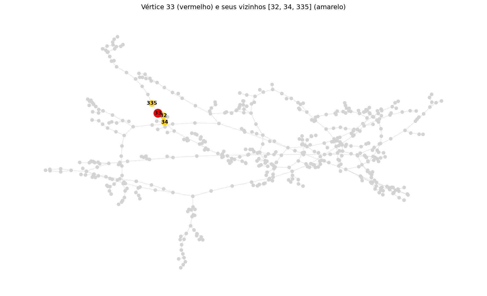

# Atividade Somativa 1 — Extração de Características em Grafos

**Disciplina:** Técnicas em Graph Mining (PUCPR)
**Base de dados:** [Grafo3_semana4.csv](Grafo3_semana4.csv) (matriz de adjacências 512 × 512)
**Script completo:** [atividade1.py](atividade1.py)

---

## Importação das bibliotecas

```python
import networkx as nx                 # criação e análise de grafos
import pandas as pd                   # leitura do arquivo CSV
import numpy as np                    # operações com a matriz de adjacências
import matplotlib.pyplot as plt       # geração das figuras
```

---

## Tarefa 1 — Criar o grafo G e verificar se é direcionado

**Código:**
```python
# lê a matriz de adjacências; header=None pois o arquivo não possui cabeçalho
matriz = pd.read_csv("Grafo3_semana4.csv", header=None)

# verificações de sanidade da matriz
A = matriz.values
print("Dimensão da matriz:", A.shape)                       # deve ser quadrada (N x N)
print("Valores presentes na matriz:", np.unique(A))         # 0/1 => grafo não valorado
print("Soma da diagonal principal:", A.trace(), "(0 = sem laços)")

# matriz simétrica (A = A^T) indica que cada conexão está representada nas duas
# direções, ou seja, a matriz representa um grafo NÃO direcionado
simetrica = np.array_equal(A, A.T)
print("A matriz de adjacências é simétrica?", simetrica)

# cria o grafo usando a classe adequada ao tipo de matriz
G = nx.from_pandas_adjacency(matriz, create_using=nx.Graph if simetrica else nx.DiGraph)

print("O grafo G é direcionado?", G.is_directed())
```

**Resultado:**
```
Dimensão da matriz: (512, 512)
Valores presentes na matriz: [0 1]
Soma da diagonal principal: 0 (0 = sem laços)
A matriz de adjacências é simétrica? True

>>> O grafo G é direcionado? False
```

**Resposta:** **False** — o grafo G **não é direcionado**.

A verificação da simetria confirma esse resultado de forma independente: como `A = Aᵀ`, cada conexão aparece nas duas posições (i,j) e (j,i) da matriz, o que caracteriza um grafo não dirigido. As demais verificações mostram que a matriz é quadrada (512 × 512), contém apenas valores 0 e 1 (grafo **não valorado**) e tem diagonal principal nula (**sem laços**) — portanto a classe `nx.Graph` é a representação correta.

---

## Tarefa 2 — Desenhar o grafo G com dimensões 12 × 7

**Código:**
```python
plt.figure(figsize=(12, 7))                       # define o tamanho da figura como 12 x 7
posicoes = nx.spring_layout(G, seed=42)           # seed fixa => desenho reproduzível
nx.draw(G, pos=posicoes, node_size=50, node_color="orange",
        edge_color="gray", width=0.5)
plt.title("Grafo G (512 vértices, 512 arestas)")
plt.show()
```

**Resultado:**


*Observação:* o parâmetro `seed=42` no `spring_layout` garante que o desenho seja **reproduzível** — sem ele, cada execução geraria uma disposição diferente dos vértices (limitação discutida na Unidade 8 do material).

---

## Tarefa 3 — Quantidade de vértices e de arestas

**Código:**
```python
print("Quantidade de vértices (ordem):", G.number_of_nodes())
print("Quantidade de arestas (tamanho):", G.number_of_edges())
```

**Resultado:**
```
>>> Quantidade de vértices (ordem): 512
>>> Quantidade de arestas (tamanho): 512
```

**Resposta:** o grafo G possui **512 vértices** (ordem) e **512 arestas** (tamanho).

*Conferência:* a soma de todos os valores 1 da matriz é 1024; como o grafo é não dirigido, cada aresta é contada duas vezes → 1024 / 2 = **512 arestas**. ✔

---

## Tarefa 4 — Grau do vértice 33 e diferença em relação ao grau médio

**Código:**
```python
grau_vertice = G.degree(33)                               # grau do vértice 33
graus = [grau for _, grau in G.degree()]                  # grau de todos os vértices
grau_medio = sum(graus) / G.number_of_nodes()             # grau médio da rede
diferenca = grau_vertice - grau_medio                     # diferença em relação à média

print("Grau do vértice 33:", grau_vertice)
print("Grau médio da rede:", round(grau_medio, 4))
print("Diferença (grau do vértice 33 - grau médio):", round(diferenca, 4))

# conferência pela fórmula do grau médio: 2*|E| / |V| (grafo não direcionado)
print("Conferência do grau médio por 2*|E|/|V|:",
      round(2 * G.number_of_edges() / G.number_of_nodes(), 4))
```

**Resultado:**
```
>>> Grau do vértice 33: 3
>>> Grau médio da rede: 2.0
>>> Diferença (grau do vértice 33 - grau médio): 1.0
Conferência do grau médio por 2*|E|/|V|: 2.0
```

**Resposta:** o vértice 33 possui **grau 3**, enquanto o **grau médio da rede é 2,0**. A diferença é de **+1,0** — ou seja, o vértice 33 possui **uma conexão a mais que a média** da rede, um grau **50% superior** ao grau médio.

Interpretação: apesar de estar acima da média, o vértice 33 **não é um vértice de destaque** na rede — 134 dos 512 vértices (26,2%) possuem grau igual ou superior a 3, e o vértice de maior grau da rede é o vértice **466**, com grau 6.

---

## Tarefa 5 — Arestas conectadas ao vértice 33 (em uma lista)

**Código:**
```python
arestas_vertice = list(G.edges(33))       # arestas incidentes ao vértice 33
vizinhos = sorted(G.neighbors(33))        # vértices vizinhos

print("Arestas conectadas ao vértice 33:", arestas_vertice)
print("Vértices vizinhos:", vizinhos)
print("Total de arestas incidentes:", len(arestas_vertice))
```

**Resultado:**
```
>>> Arestas conectadas ao vértice 33: [(33, 32), (33, 34), (33, 335)]
>>> Vértices vizinhos: [32, 34, 335]
>>> Total de arestas incidentes: 3 (confere com o grau obtido na Tarefa 4)
```

**Resposta:** o vértice 33 está conectado por **3 arestas**, aos vértices **32**, **34** e **335**:

| # | Aresta | Vértice vizinho |
|---|---|---|
| 1 | (33, 32) | 32 |
| 2 | (33, 34) | 34 |
| 3 | (33, 335) | 335 |

O total de 3 arestas confirma o grau 3 obtido na Tarefa 4. ✔

**Figura complementar** — o vértice 33 (vermelho) e seus vizinhos (amarelo) na estrutura da rede:



---

## Tarefa 6 — Distribuição de graus em uma figura com dimensões 10 × 5

**Código:**
```python
# conta quantos vértices existem para cada valor de grau
valores, frequencias = np.unique(graus, return_counts=True)

plt.figure(figsize=(10, 5))                               # tamanho da figura: 10 x 5
plt.bar(valores, frequencias, color="blue")
plt.title("Distribuição de graus do grafo G")
plt.xlabel("Grau")
plt.ylabel("Frequência")
plt.xticks(valores)
for v, f in zip(valores, frequencias):                    # rotula cada barra
    plt.text(v, f + 3, str(f), ha="center", fontsize=9)
plt.show()
```

**Resultado:**


**Tabela da distribuição de graus:**

| Grau | Quantidade de vértices | % do total |
|---|---|---|
| 1 | 179 | 35,0% |
| 2 | 199 | 38,9% |
| 3 | 94 | 18,4% |
| 4 | 36 | 7,0% |
| 5 | 3 | 0,6% |
| 6 | 1 | 0,2% |
| **Total** | **512** | **100%** |

### Análise da distribuição

A distribuição é **assimétrica à direita**, com pico no grau 2 e decaimento acentuado a partir dele: 73,9% dos vértices possuem apenas 1 ou 2 conexões, enquanto somente 4 vértices (0,8%) possuem grau 5 ou 6. Não há vértices isolados (grau mínimo = 1) e o grau máximo é apenas 6.

Para caracterizar melhor a rede, foram extraídas métricas complementares:

| Métrica | Valor |
|---|---|
| Grau mínimo / máximo | 1 / 6 |
| Grau médio | 2,0 |
| Densidade | 0,0039 |
| Coeficiente de agrupamento médio | **0,0** |
| Componentes conexas | 1 (grafo **conexo**) |
| É árvore? | Não |
| Ciclos independentes (número ciclomático) | **1** |

**Conclusão da análise:** embora o formato decrescente lembre uma cauda longa, **não se trata de uma rede livre de escala** nos termos discutidos na Unidade 3 do material. Três evidências sustentam isso:

1. **Não existem *hubs*:** o grau máximo é 6 contra uma média de 2,0 — uma amplitude pequena demais para caracterizar a lei de potência, em que poucos vértices concentrariam ordens de magnitude mais conexões que os demais.
2. **Coeficiente de agrupamento médio igual a 0:** a rede **não possui nenhum triângulo**, ou seja, não há transitividade nem estrutura de comunidades — o oposto do que se observa em redes complexas reais (redes sociais, colaboração científica), que apresentam alto agrupamento.
3. **Estrutura quase arbórea:** com 512 vértices, 512 arestas, conexa e com número ciclomático igual a 1, a rede é essencialmente uma **árvore com uma única aresta extra** (grafo unicíclico). Isso explica tanto a grande quantidade de vértices de grau 1 (as "folhas" da estrutura) quanto a ausência total de triângulos.

Trata-se, portanto, de uma **rede muito esparsa e ramificada** (densidade de apenas 0,39%), com topologia próxima à de uma árvore — compatível com estruturas hierárquicas ou de distribuição/ramificação, e visualmente confirmada pelo desenho da Tarefa 2.

---

## Resumo dos resultados

| Tarefa | Resultado |
|---|---|
| 1. O grafo é direcionado? | **False** (não direcionado — matriz simétrica, sem laços, não valorado) |
| 2. Desenho do grafo (12 × 7) | [figura_grafo_12x7.png](figura_grafo_12x7.png) |
| 3. Vértices / Arestas | **512 vértices** e **512 arestas** |
| 4. Grau do vértice 33 vs. grau médio | Grau **3** vs. grau médio **2,0** → diferença de **+1,0** (50% acima da média) |
| 5. Arestas do vértice 33 | `[(33, 32), (33, 34), (33, 335)]` — 3 arestas |
| 6. Distribuição de graus (10 × 5) | [figura_distribuicao_graus_10x5.png](figura_distribuicao_graus_10x5.png) — assimétrica, com pico no grau 2 |

---

## Nota metodológica sobre a numeração dos vértices

O arquivo CSV não possui cabeçalho nem coluna de índice, então os vértices foram rotulados de **0 a 511**, seguindo a convenção padrão do NetworkX (e a mesma adotada nos exemplos da Unidade 4 do material da disciplina, cujos grafos são numerados a partir de 0). Assim, "vértice 33" corresponde à linha/coluna de índice 33.

Caso a numeração pretendida pela disciplina inicie em 1 (o que faria "vértice 33" corresponder ao índice 32), verificou-se que:

- **A resposta da Tarefa 4 não muda:** o vértice de índice 32 também possui **grau 3**, mantendo a diferença de **+1,0** em relação ao grau médio.
- **Apenas a Tarefa 5 mudaria:** as arestas passariam a ser `[(32, 5), (32, 33), (32, 421)]`, com vizinhos 5, 33 e 421.
