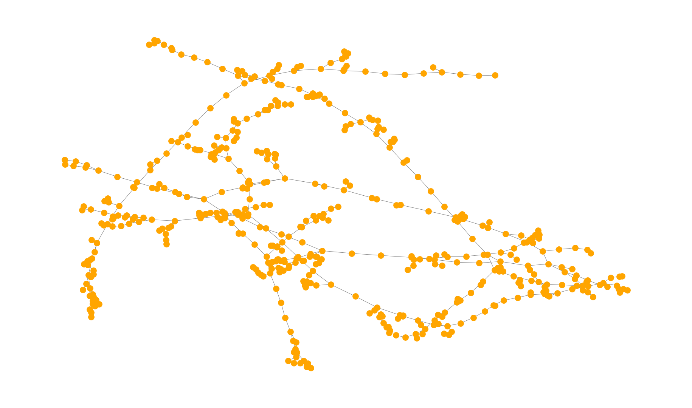
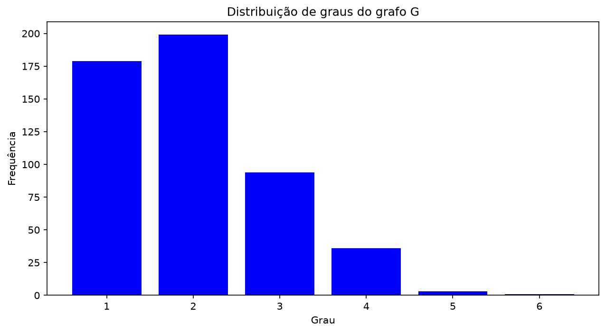

# Atividade Somativa 1 — Extração de Características em Grafos

**Disciplina:** Técnicas em Graph Mining (PUCPR)
**Base de dados:** [Grafo3_semana4.csv](Grafo3_semana4.csv) (matriz de adjacências 512 × 512)
**Script completo:** [atividade1.py](atividade1.py)

---

## Importação das bibliotecas

```python
import networkx as nx                 # biblioteca para criação e análise de grafos
import pandas as pd                   # leitura do arquivo CSV
import numpy as np                    # operações com a matriz de adjacências
import matplotlib.pyplot as plt       # geração das figuras
```

---

## Tarefa 1 — Criar o grafo G e verificar se é direcionado

**Código:**
```python
# lê a matriz de adjacências; header=None pois o arquivo não possui cabeçalho
matriz = pd.read_csv("Grafo3_semana4.csv", header=None)

# verifica se a matriz é simétrica (matriz simétrica => grafo NÃO direcionado)
simetrica = np.array_equal(matriz.values, matriz.values.T)
print("A matriz de adjacências é simétrica?", simetrica)

# cria o grafo a partir da matriz de adjacências
G = nx.from_pandas_adjacency(matriz, create_using=nx.Graph)

# verifica se o grafo criado é direcionado (resposta em True ou False)
print("O grafo G é direcionado?", G.is_directed())
```

**Resultado:**
```
A matriz de adjacências é simétrica? True
O grafo G é direcionado? False
```

**Resposta:** **False** — o grafo G **não é direcionado**. A verificação da simetria da matriz de adjacências confirma esse resultado: como `A = Aᵀ`, cada conexão está representada nas duas direções (i,j) e (j,i), o que caracteriza um grafo não dirigido.

---

## Tarefa 2 — Desenhar o grafo G com dimensões 12 × 7

**Código:**
```python
plt.figure(figsize=(12, 7))                  # define o tamanho da figura como 12 x 7
nx.draw(G, node_size=50, node_color="orange", edge_color="gray", width=0.5)
plt.show()
```

**Resultado:**



---

## Tarefa 3 — Quantidade de vértices e de arestas

**Código:**
```python
print("Quantidade de vértices (ordem):", G.number_of_nodes())
print("Quantidade de arestas (tamanho):", G.number_of_edges())
```

**Resultado:**
```
Quantidade de vértices (ordem): 512
Quantidade de arestas (tamanho): 512
```

**Resposta:** o grafo G possui **512 vértices** (ordem) e **512 arestas** (tamanho).

---

## Tarefa 4 — Grau do vértice 33 e diferença em relação ao grau médio

**Código:**
```python
grau_33 = G.degree(33)                                   # grau do vértice 33
graus = [grau for _, grau in G.degree()]                 # lista com o grau de todos os vértices
grau_medio = sum(graus) / G.number_of_nodes()            # grau médio da rede
diferenca = grau_33 - grau_medio                         # diferença entre o grau do vértice e a média

print("Grau do vértice 33:", grau_33)
print("Grau médio da rede:", round(grau_medio, 4))
print("Diferença (grau do vértice 33 - grau médio):", round(diferenca, 4))
```

**Resultado:**
```
Grau do vértice 33: 3
Grau médio da rede: 2.0
Diferença (grau do vértice 33 - grau médio): 1.0
```

**Resposta:** o vértice 33 possui **grau 3**, enquanto o **grau médio da rede é 2,0**. A diferença é de **+1,0** — ou seja, o vértice 33 possui **uma conexão a mais que a média** da rede, o que representa um grau **50% superior** ao grau médio.

*Observação:* o grau médio confere com a fórmula `2·|E| / |V| = (2 × 512) / 512 = 2,0`.

---

## Tarefa 5 — Arestas conectadas ao vértice 33 (em uma lista)

**Código:**
```python
arestas_33 = list(G.edges(33))     # conjunto de arestas incidentes ao vértice 33
print("Arestas conectadas ao vértice 33:", arestas_33)
print("Total de arestas conectadas ao vértice 33:", len(arestas_33))
```

**Resultado:**
```
Arestas conectadas ao vértice 33: [(33, 32), (33, 34), (33, 335)]
Total de arestas conectadas ao vértice 33: 3
```

**Resposta:** o vértice 33 está conectado por **3 arestas**, aos vértices **32**, **34** e **335**:

| # | Aresta | Vértice vizinho |
|---|---|---|
| 1 | (33, 32) | 32 |
| 2 | (33, 34) | 34 |
| 3 | (33, 335) | 335 |

O total de 3 arestas confirma o grau 3 obtido na Tarefa 4.

---

## Tarefa 6 — Distribuição de graus em uma figura com dimensões 10 × 5

**Código:**
```python
plt.figure(figsize=(10, 5))                                   # define o tamanho da figura como 10 x 5
valores, frequencias = np.unique(graus, return_counts=True)   # conta quantos vértices há em cada grau
plt.bar(valores, frequencias, color="blue")
plt.title("Distribuição de graus do grafo G")
plt.xlabel("Grau")
plt.ylabel("Frequência")
plt.xticks(valores)
plt.show()
```

**Resultado:**



**Tabela da distribuição de graus:**

| Grau | Quantidade de vértices |
|---|---|
| 1 | 179 |
| 2 | 199 |
| 3 | 94 |
| 4 | 36 |
| 5 | 3 |
| 6 | 1 |
| **Total** | **512** |

**Análise:** a distribuição apresenta um formato de **cauda longa** (decaimento acentuado a partir do grau 2): a grande maioria dos vértices possui poucas conexões (378 vértices, ou 73,8% do total, têm grau 1 ou 2), enquanto pouquíssimos vértices concentram mais conexões (apenas 4 vértices, menos de 1%, possuem grau 5 ou 6). Esse comportamento é característico de **redes complexas reais**, diferentemente da distribuição Gaussiana observada em redes geradas de forma puramente aleatória. Trata-se ainda de uma **rede esparsa**, com grau médio de apenas 2,0 conexões por vértice.

---

## Resumo dos resultados

| Tarefa | Resultado |
|---|---|
| 1. O grafo é direcionado? | **False** (não direcionado — matriz simétrica) |
| 2. Desenho do grafo (12 × 7) | [figura_grafo_12x7.png](figura_grafo_12x7.png) |
| 3. Vértices / Arestas | **512 vértices** e **512 arestas** |
| 4. Grau do vértice 33 vs. grau médio | Grau 3 vs. grau médio 2,0 → diferença de **+1,0** |
| 5. Arestas do vértice 33 | `[(33, 32), (33, 34), (33, 335)]` |
| 6. Distribuição de graus (10 × 5) | [figura_distribuicao_graus_10x5.png](figura_distribuicao_graus_10x5.png) |
