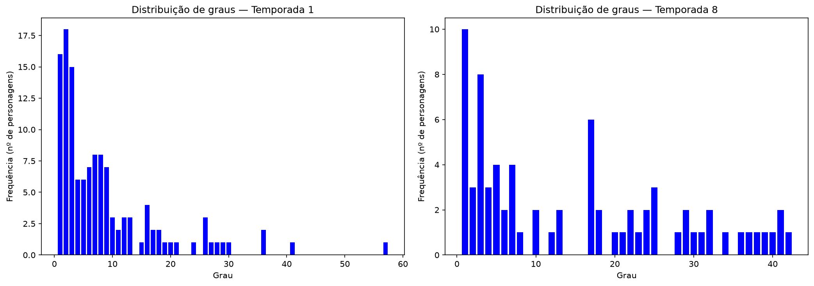
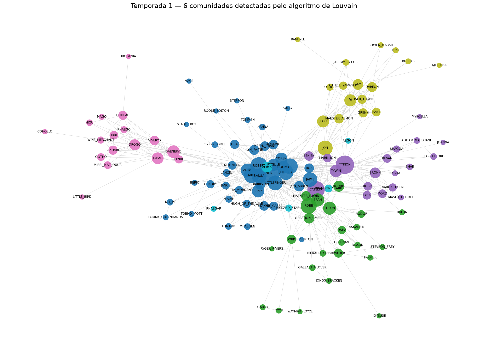
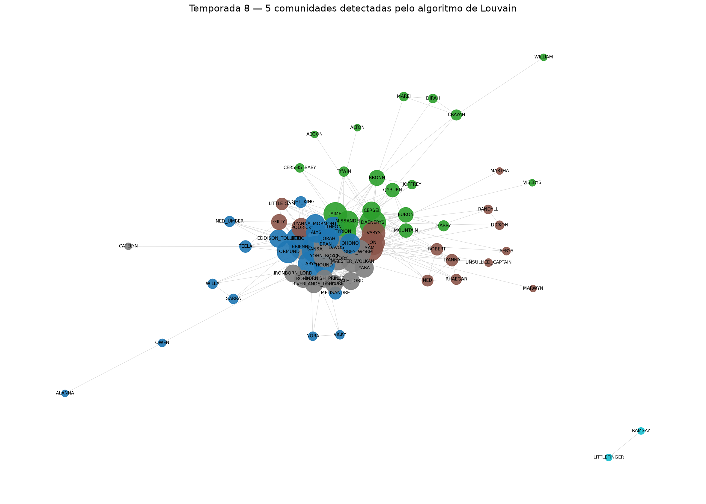

# Atividade Somativa 2 — Mineração de grafos com dados de *Game of Thrones*

**Disciplina:** Técnicas em Graph Mining (PUCPR)
**Dados:** [got-s1-edges_semanas7_8.csv](got-s1-edges_semanas7_8.csv) (1ª temporada) e [got-s8-edges_semanas7_8 .csv](got-s8-edges_semanas7_8%20.csv) (8ª temporada)
**Código:** [atividade2.py](atividade2.py)

```python
import networkx as nx
import pandas as pd

S1 = pd.read_csv("got-s1-edges_semanas7_8.csv", delimiter=",")
Grafo_Temporada1 = nx.from_pandas_edgelist(S1, source='Source', target='Target', edge_attr='Weight')

S8 = pd.read_csv("got-s8-edges_semanas7_8 .csv", delimiter=",")
Grafo_Temporada8 = nx.from_pandas_edgelist(S8, source='Source', target='Target', edge_attr='Weight')
```

---

## Tarefa 1 — Comparação estrutural das redes

### Métricas obtidas

| Métrica | Temporada 1 | Temporada 8 | Variação |
|---|---|---|---|
| Vértices (personagens) | 126 | 74 | −41,3% |
| Arestas (interações) | 549 | 553 | +0,7% |
| **Grau médio** | **8,7143** | **14,9459** | **+71,5%** |
| **Densidade** | **0,0697** | **0,2047** | **+193,7%** |
| **Transitividade** (coef. global) | **0,3833** | **0,6442** | **+68,1%** |
| Coef. de agrupamento médio | 0,6297 | 0,6747 | +7,1% |
| Grau mínimo / máximo | 1 / 57 | 1 / 42 | — |
| Personagem de maior grau | NED (57) | SAM (42) | — |
| Componentes conexas | 1 | 2 | — |

### Histogramas da distribuição de graus



### Discussão

O contraste mais revelador está na combinação dos dois primeiros números: a 8ª temporada tem **41% menos personagens**, mas praticamente **o mesmo número de interações** (553 contra 549). Isso significa que a mesma massa de interações passou a se concentrar em um elenco muito menor, e é a causa direta das três medidas solicitadas:

- **Grau médio** salta de 8,71 para 14,95 (+71%): cada personagem da S8 interage, em média, com o dobro de colegas de elenco.
- **Densidade** quase triplica, de 0,0697 para 0,2047: na S1, apenas 7% das conexões possíveis existiam; na S8, mais de 20%.
- **Transitividade** sobe de 0,3833 para 0,6442 (+68%): na S8, se dois personagens interagem com um terceiro, há quase 2/3 de chance de eles também interagirem entre si.

As **distribuições de graus** mostram redes qualitativamente diferentes:

- **Temporada 1**: formato de **cauda longa**, típico de rede complexa com *hubs*: 49 dos 126 personagens (39%) têm grau ≤ 3, com decaimento acentuado e um **hub isolado e dominante**, NED (grau 57, mais de 6× o grau médio e 39% acima do segundo colocado). A rede é esparsa e periférica, com muitos personagens de participação pontual.
- **Temporada 8**: distribuição muito mais **achatada e espalhada**, sem um vértice dominante: há um patamar de personagens com graus altos (17 personagens com grau ≥ 28, e 6 com grau exatamente 17), e o grau máximo (42, de SAM) é apenas 2,8× o grau médio. Ou seja, **o elenco principal inteiro interage intensamente entre si**, em vez de se organizar ao redor de um único articulador.

**Interpretação narrativa:** a 1ª temporada distribui a história em tramas paralelas geograficamente separadas (Porto Real, Winterfell, a Muralha, Essos), ligadas por poucos personagens-ponte (daí a rede grande), esparsa e com um hub claro. Na 8ª temporada as tramas já convergiram: os sobreviventes estão concentrados nos mesmos locais e nas mesmas cenas, produzindo uma rede pequena, densa e altamente transitiva.

**Desconexão:** a rede da S8 é a única **desconexa** (2 componentes). A componente isolada contém apenas **LITTLEFINGER e RAMSAY**.

---

## Tarefa 2 — Os 3 personagens mais centrais

### Temporada 1

| Medida de centralidade | 1º | 2º | 3º |
|---|---|---|---|
| Grau | **NED** (0,4560) | TYRION (0,3280) | ROBERT (0,2880) |
| Intermediação | **NED** (0,3033) | TYRION (0,1630) | CATELYN (0,1183) |
| Proximidade | **NED** (0,6281) | ROBERT (0,5531) | CATELYN (0,5507) |
| Autovetor | **NED** (0,3151) | ROBERT (0,2482) | CERSEI (0,2393) |

### Temporada 8

| Medida de centralidade | 1º | 2º | 3º |
|---|---|---|---|
| Grau | **SAM** (0,5915) | DAENERYS (0,5775) | TYRION (0,5775) |
| Intermediação | **DAENERYS** (0,1416) | SAM (0,1048) | ARYA (0,1047) |
| Proximidade | **SAM** (0,6961) | DAENERYS (0,6893) | TYRION (0,6893) |
| Autovetor | **TYRION** (0,2179) | SAM (0,2172) | SANSA (0,2158) |

### Resposta: algum personagem é central em ambas as temporadas?

**Sim — TYRION é o único personagem que aparece no top 3 nas duas temporadas:**

| | Temporada 1 | Temporada 8 |
|---|---|---|
| Grau | 2º (0,3280) | 3º (0,5775) |
| Intermediação | 2º (0,1630) | — |
| Proximidade | — | 3º (0,6893) |
| Autovetor | — | **1º (0,2179)** |

Comparando os conjuntos completos de personagens que entram em algum top 3:
- **Temporada 1:** CATELYN, CERSEI, NED, ROBERT, TYRION
- **Temporada 8:** ARYA, DAENERYS, SAM, SANSA, TYRION
- **Interseção: TYRION**

Dois padrões merecem destaque:

1. **NED lidera as quatro medidas na 1ª temporada**, um domínio absoluto que confirma seu papel de hub único identificado na Tarefa 1. Ele é simultaneamente o mais conectado (grau), o principal intermediário entre as tramas (intermediação), o mais próximo de todos (proximidade) e o mais conectado a personagens importantes (autovetor).

2. **Na 8ª temporada não existe esse domínio:** a liderança se divide entre três personagens, SAM (grau e proximidade), DAENERYS (intermediação) e TYRION (autovetor). Isso é coerente com a distribuição de graus achatada: sem um hub dominante, diferentes personagens ocupam posições privilegiadas segundo diferentes critérios de importância.

É interessante notar que **TYRION lidera o autovetor** sem liderar o grau, exatamente o comportamento que essa medida busca capturar: sua importância vem da *qualidade* de suas conexões (Cersei, Jaime, Daenerys, Varys), não da quantidade.

---

## Tarefa 3 — Detecção de comunidades (algoritmo de Louvain)

Foi aplicado o **algoritmo de Louvain** (`nx.community.louvain_communities`, semente fixa = 42) nas duas redes — método aglomerativo baseado na maximização da modularidade, escolhido por sua eficiência e pela melhor qualidade de modularidade em relação a Girvan-Newman e CNM.

### Temporada 1 — 6 comunidades (modularidade 0,4512)



| # | Tam. | Interpretação | Principais personagens |
|---|---|---|---|
| C1 | 44 | **Porto Real / corte** | NED, ROBERT, CERSEI, JOFFREY, SANSA, ARYA, JAIME, VARYS, RENLY, STANNIS |
| C2 | 24 | **Winterfell / Norte** | ROBB, BRAN, THEON, HODOR, OSHA, RICKON, MAESTER_LUWIN, RODRIK |
| C3 | 19 | **Lannister / Vale** | TYRION, TYWIN, CATELYN, LYSA, BRONN, SHAE, KEVAN |
| C4 | 17 | **Essos / Daenerys** | DAENERYS, DROGO, JORAH, VISERYS, IRRI, DOREAH, ILLYRIO |
| C5 | 17 | **Muralha / Patrulha da Noite** | JON, SAM, JEOR, MAESTER_AEMON, PYP, GRENN, ALLISER_THORNE |
| C6 | 5 | **Rebelião / passado** | AERYS, RHAEGAR, BRANDON_STARK, RICKARD_STARK, AEGON |

### Temporada 8 — 5 comunidades (modularidade 0,2075)



| # | Tam. | Interpretação | Principais personagens |
|---|---|---|---|
| C1 | 21 | **Norte / Winterfell** | ARYA, SANSA, THEON, TORMUND, HOUND, BERIC, JORAH, MELISANDRE, NIGHT_KING |
| C2 | 20 | **Porto Real / Lannister + Daenerys** | CERSEI, JAIME, TYRION, TYWIN, BRONN, EURON, QYBURN, MOUNTAIN, DAENERYS, MISSANDEI |
| C3 | 16 | **Jon / Sam e a linhagem Targaryen** | JON, SAM, GILLY, LITTLE_SAM, AERYS, RHAEGAR, NED, LYANNA, VARYS |
| C4 | 15 | **Bran / conselho e casas** | BRAN, BRIENNE, DAVOS, GREY_WORM, YARA, EDMURE, ROBIN, YOHN_ROYCE |
| C5 | 2 | **Díade isolada (mortos)** | LITTLEFINGER, RAMSAY |

### O número de comunidades é o mesmo?

**Não.** A 1ª temporada apresenta **6 comunidades** e a 8ª apresenta **5**, sendo que uma delas (C5) é a díade trivial LITTLEFINGER–RAMSAY, correspondente à componente desconexa. Em termos de grupos substantivos, portanto, a comparação é de **6 contra 4**.

Mais relevante que a contagem é a **qualidade** das partições: a modularidade cai de **0,4512** para **0,2075**, menos da metade. Isso confirma quantitativamente o que as figuras mostram: na S1 as comunidades são nítidas e espacialmente separadas (cada trama em sua região geográfica); na S8 o grafo forma um **núcleo denso e emaranhado**, em que as comunidades se sobrepõem visualmente e as fronteiras entre grupos ficam difusas. É a consequência direta da densidade quase três vezes maior medida na Tarefa 1, quanto mais todos interagem com todos, menos sentido tem falar em grupos separados.

### É possível identificar uma comunidade similar em ambas as temporadas?

**Sim.** Como apenas **30 personagens** aparecem nas duas temporadas (o elenco se renovou fortemente), a comparação foi feita restringindo as comunidades a esse conjunto comum, medindo a sobreposição pelo índice de Jaccard:

| Jaccard | S1 | S8 | Personagens que permaneceram no mesmo grupo |
|---|---|---|---|
| **0,333** | C5 | C3 | **JON, SAM**, RANDYLL |
| 0,286 | C3 | C4 | CATELYN, ROBIN |
| **0,250** | C3 | C2 | **TYRION, TYWIN, BRONN** |
| **0,250** | C1 | C1 | **ARYA, SANSA**, HOUND, BERIC |
| 0,211 | C1 | C3 | LYANNA, NED, ROBERT, VARYS |
| 0,200 | C1 | C2 | **CERSEI, JAIME**, JOFFREY, MOUNTAIN |

Três correspondências se destacam:

1. **A dupla JON–SAM é o agrupamento mais estável da série** (Jaccard 0,333, o maior valor). O que na 1ª temporada era C5 reaparece na 8ª como a comunidade C3.

2. **O núcleo Lannister se mantém, mas se funde.** Na S1 ele estava **dividido em duas comunidades**: Cersei/Jaime/Joffrey em Porto Real (C1) e Tyrion/Tywin/Bronn no grupo Lannister/Vale (C3). Na S8 ambos os subgrupos aparecem **na mesma comunidade C2**, agora junto de Daenerys, refletindo a convergência de todas essas tramas no cerco a Porto Real.

3. **O núcleo Stark do Norte persiste:** ARYA e SANSA, acompanhadas de HOUND e BERIC, permanecem agrupadas (S1-C1 → S8-C1).

---

## Conclusão

A comparação mostra duas redes com a **mesma quantidade de interações distribuída de formas radicalmente diferentes**. A 1ª temporada é uma rede **grande, esparsa e modular** (126 personagens, densidade 0,07, modularidade 0,45), organizada em tramas geograficamente separadas e articulada por um hub único e incontestável, NED, líder das quatro medidas de centralidade. A 8ª temporada é uma rede **pequena, densa e pouco modular** (74 personagens, densidade 0,20, modularidade 0,21), em que o elenco sobrevivente interage massivamente entre si, a transitividade é alta (0,64) e a centralidade se distribui entre vários personagens (SAM, DAENERYS, TYRION), sem hub dominante.

Dos personagens analisados, **TYRION é o único que permanece entre os três mais centrais nas duas temporadas**, e a dupla **JON–SAM** constitui o agrupamento comunitário mais estável ao longo da série.

---

## Nota metodológica

- **Centralidades:** a centralidade de autovetor não é bem definida em grafos desconexos (o NetworkX levanta `AmbiguousSolution`), limitação análoga à discutida na Unidade 5 para a centralidade de proximidade. Como a rede da S8 possui duas componentes, **todas as centralidades foram calculadas sobre a maior componente conexa** de cada rede, garantindo comparabilidade entre as quatro medidas. Na S1 isso corresponde à rede inteira (126 personagens); na S8, a 72 dos 74 personagens (excluídos apenas LITTLEFINGER e RAMSAY, ambos de grau 1 e sem chance de figurar entre os mais centrais).
- **Pesos das arestas:** as medidas foram calculadas em sua forma **não ponderada** (padrão do NetworkX e das fórmulas apresentadas na disciplina). O atributo `Weight` foi carregado no grafo e permanece disponível para análises ponderadas.
- **Reprodutibilidade:** semente fixa (`seed=42`) no algoritmo de Louvain e no `spring_layout`, de modo que comunidades e figuras sejam idênticas em novas execuções.
